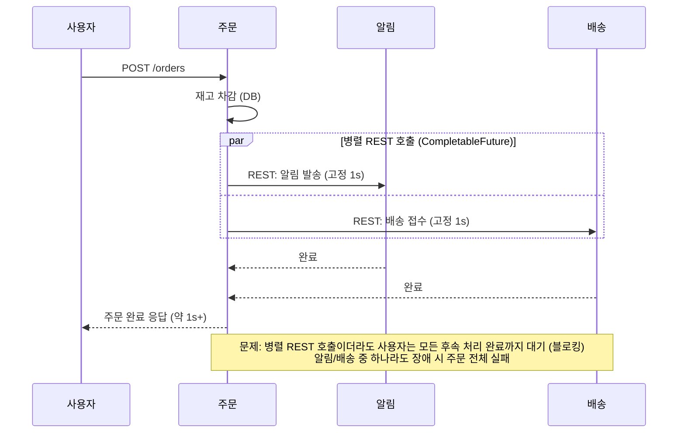
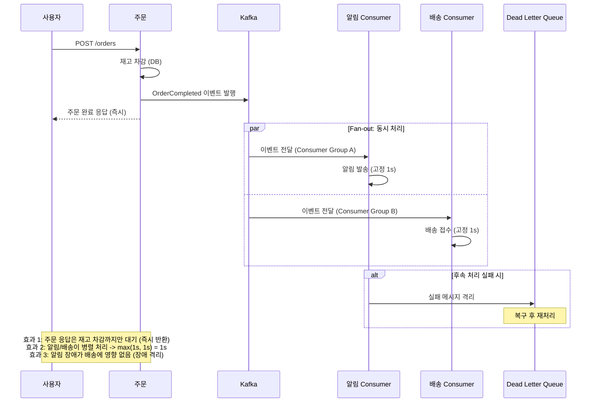
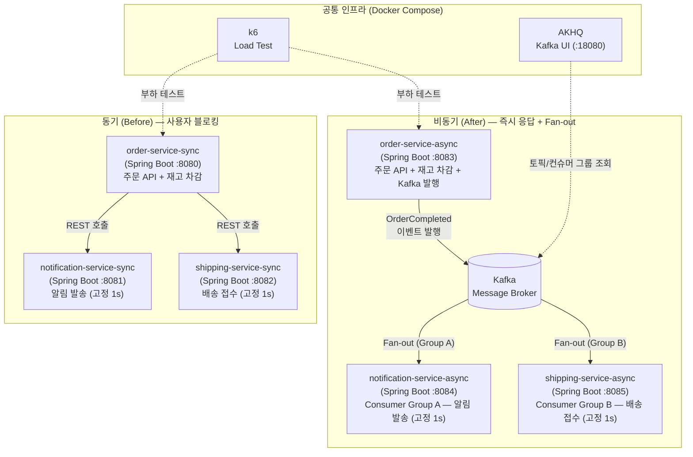
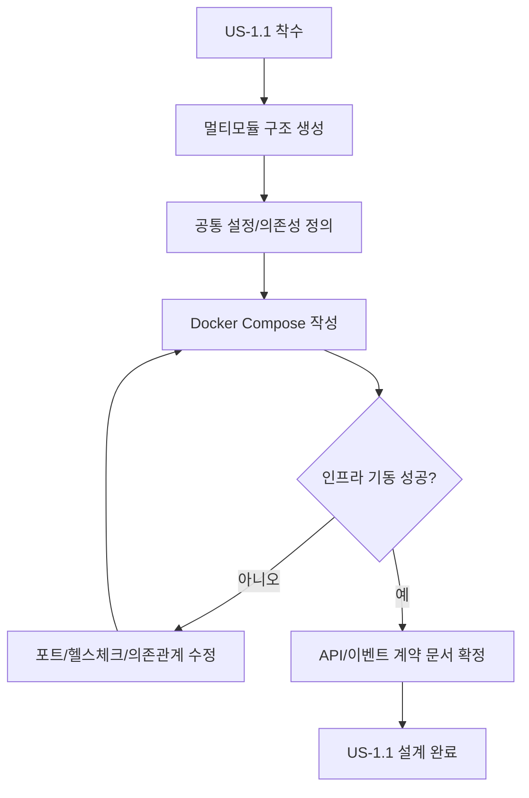

# Design Implementation v1 - EDA PoC Sprint 1 (US-1.1)

## 한눈에 결론
- 설계 핵심 결론: US-1.1은 "실행 가능한 기반" 구축에 집중하고, 비즈니스 동작 비교는 US-1.2에서 완성한다.
- 확정된 설계 결정 2~3개:
  - 멀티모듈 구조를 `sync 3개 + async 3개 + shared-contract`로 고정한다.
  - Kafka는 단일 브로커 KRaft + Docker Compose로 구성한다.
  - API/이벤트 계약을 먼저 고정하고 구현은 계약 기준으로 진행한다.
- 바로 구현할 항목:
  - 프로젝트 스캐폴딩, Docker Compose 인프라, API/이벤트 명세 초안
- 핵심 리스크:
  - 컨테이너 기동 순서/헬스체크 미비 시 서비스 기동 실패 가능

---

## 1) 구조 설계
### 1-1. 기능과 경계
- 핵심 기능:
  - Gradle 멀티모듈 골격 생성
  - Kafka/AKHQ 포함 Compose 인프라 구성
  - 주문 API 2종(동기/비동기) 및 `OrderCompleted` 이벤트 계약 정의
- 포함(In Scope):
  - 모듈/패키지 구조, 공통 의존성, 기본 설정
  - 인프라 기동 기준(포트/헬스체크/의존관계)
  - API/이벤트 계약 및 에러 응답 규칙
- 제외(Out of Scope):
  - 멱등성 저장소 상세 구현
  - DLQ 재처리 구현
  - k6 성능 스크립트 작성

### 1-2. 다이어그램 (Business-first, 다중 허용)
- 비즈니스 흐름을 우선 제시하고, 기술 흐름은 구현 리스크 전달 목적에서 보조로 사용한다.
- 동일 타입 다이어그램은 시나리오별로 여러 개 작성할 수 있다.

#### A. 비즈니스 흐름 다이어그램
##### A-1. 동기 방식 비즈니스 흐름 (Before, sprint-0 기준본 재사용)

##### A-2. 비동기 방식 비즈니스 흐름 (After, sprint-0 기준본 재사용)

#### B. 기술 흐름 다이어그램
##### B-1. C4 Container (sprint-0 기준본 재사용)

##### B-2. 구현 순서 Flowchart (US-1.1 전달용)

## 2) 인터페이스와 ADR
### 2-1. 인터페이스 정의
- 입력:
  - `POST /api/sync/orders`
  - `POST /api/async/orders`
  - Request Body (공통):
    - `orderId` (string)
    - `productId` (string)
    - `quantity` (number)
    - `customerId` (string)
- 출력:
  - Sync: `201 Created` + `{"orderId":"...","status":"COMPLETED"}`
  - Async: `202 Accepted` + `{"orderId":"...","status":"ACCEPTED"}`
  - Error: `4xx/5xx` + `{"code":"...","message":"..."}`
- 이벤트/메시지:
  - Topic: `order.completed.v1`
  - Key: `orderId`
  - Value(JSON):
    - `eventId`, `occurredAt`, `orderId`, `productId`, `quantity`, `customerId`

### 2-2. ADR 요약
| ADR | Decision | Why | Trade-off |
| --- | --- | --- | --- |
| ADR-001 | Gradle 멀티모듈 + 6서비스(+shared-contract) 구조 채택 | 동기/비동기 구현을 물리적으로 분리해 비교 가시성 확보 | 초기 모듈 설정 파일 증가 |
| ADR-002 | Kafka 단일 브로커(KRaft) + Compose 채택 | 로컬 재현성과 운영 단순성 우선 | 단일 브로커라 장애 내성 검증은 제한적 |
| ADR-003 | 이벤트 스키마 JSON + `orderId` 키 고정 | 초기 구현 속도와 순서 보장 기준을 동시에 만족 | 스키마 진화 관리는 후속 스프린트 과제 |

## 3) 구현 전달 정보
- 구현 우선순위:
  1. Step-1.1.1-a: 루트 Gradle 파일(`settings`, `build`, `properties`) 생성
  2. Step-1.1.1-b: `shared-contract` DTO/이벤트 스키마 작성
  3. Step-1.1.1-c: 6개 서비스 모듈 기본 부트 앱/리소스 골격 생성
  4. Step-1.1.2-a: Compose에 Kafka(KRaft)+AKHQ만 먼저 구성
  5. Step-1.1.2-b: Sync 3개 서비스 Compose 연결 + 포트 확인
  6. Step-1.1.2-c: Async 3개 서비스 Compose 연결 + Kafka 의존관계 확인
  7. Step-1.1.3-a: `POST /api/sync/orders` 계약 구현(201)
  8. Step-1.1.3-b: `POST /api/async/orders` 계약 구현(202)
  9. Step-1.1.4-a: `order-service-async` 이벤트 발행 구현
  10. Step-1.1.4-b: 알림/배송 Kafka consumer(group 분리) 구현
  11. Step-1.1.5-a: `docker compose config` 정합성 검증
  12. Step-1.1.5-b: 최소 테스트(`shared-contract`, `order-service-*`) 실행 및 증적 기록
- 마이크로 스텝 리뷰 게이트:
  - 기본 순서: `한 스텝 구현 -> 검증 -> 사용자 리뷰 -> 다음 스텝`
  - 리뷰 게이트 통과 조건: 해당 스텝 기준 코드/테스트/컨벤션 리뷰 완료
- 테스트 포인트:
  - `docker compose up` 후 Kafka/서비스 헬스 체크 성공
  - Sync/Async 주문 엔드포인트가 계약대로 응답
  - Async 요청 시 Kafka 토픽에 메시지 적재 확인
- 리스크/완화:
  - 리스크: 포트 충돌 -> 완화: 포트 매핑 테이블 고정(8080~8085, 9092, 18080)
  - 리스크: 서비스 조기기동 실패 -> 완화: Compose healthcheck + 재시도
- 선행 의존사항:
  - Docker/Java 21/Gradle 실행 환경
  - `.agile/context/tech-stack.md`
- US 루프 순서: `execute-implementation -> design-test -> execute-test -> monitor-sprint`

## 4) 대상 범위와 목표
- 대상 US (기본 1개): `US-1.1`
- 동시 설계 여부: 단일 US
- 다중 US 예외 근거(해당 시): 해당 없음
- 이번 설계 목표:
  - 재현 가능한 개발/실행 기반(구조+인프라+계약) 확정
- 완료 기준:
  - 멀티모듈/서비스 구조, Compose, API/이벤트 스펙이 문서로 합의됨
- 제외 범위:
  - 동기/비동기 성능 비교 실행
  - 장애 격리 실험, DLQ 재처리 시나리오

## 5) 기술 스택과 전제
- 기술 스택 문서: `.agile/context/tech-stack.md`
- 사용 방식: 신규 생성
- 설계 전제/제약:
  - 스프린트 기간: 2026-03-05 ~ 2026-03-09
  - US-1.1 완료 목표일: 2026-03-07
  - 코드 작성은 다음 단계(`/execute-implementation`)에서 수행

---

## 부록) 운영 로그 (필요 시만 작성)
- C4 판단 게이트: 생성 권장 | 생성(기본값 적용) | 외부 의존성(Kafka/AKHQ/6서비스)이 많아 경계 명시 필요
- 설계 변경 이력:
  - v1 (2026-03-05): US-1.1 단일 대상 설계 초안 작성
