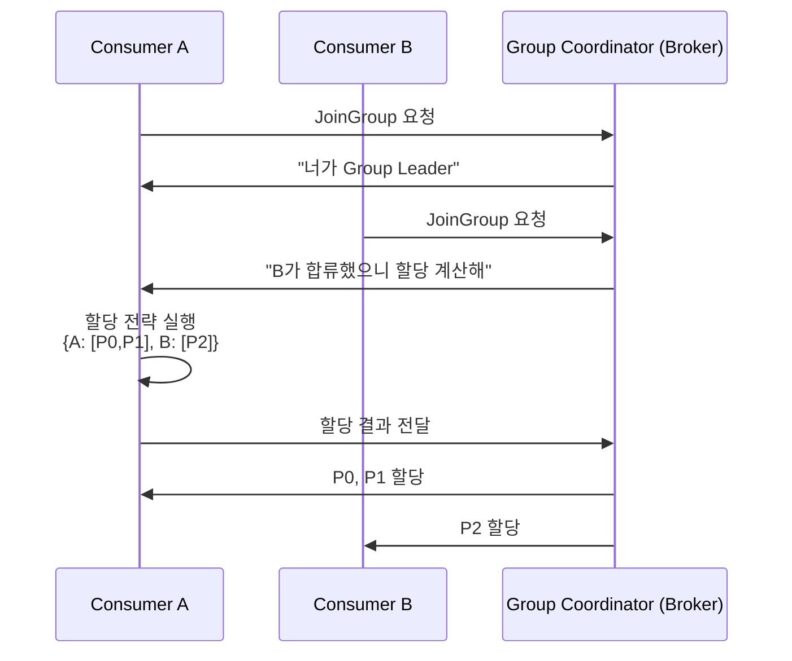
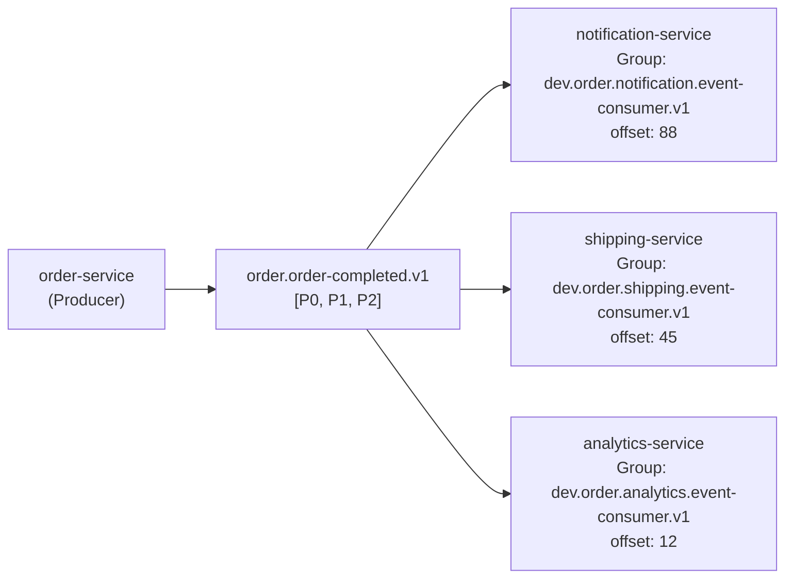

# Consumer Group

## 왜 필요한가

핵심은 **offset을 누가 공유하느냐**다.

- 같은 `group.id`를 쓰는 Consumer들은 하나의 Consumer Group으로 동작하고 offset을 공유한다.
- 다른 `group.id`를 쓰면 Topic은 같아도 offset이 분리되어, 각 서비스가 독립적으로 처음부터(또는 최신부터) 소비할 수 있다.

즉 주문 완료 이벤트를 알림 서비스와 배송 서비스가 각각 처리하려면, 두 서비스는 서로 다른 Consumer Group이어야 한다.  
한 서비스의 처리 지연/장애가 다른 서비스 소비 위치(offset)에 영향을 주지 않는다.

실무 예시:

```
Topic: order.order-completed.v1

Group A: prod.order.notification.event-consumer.v1
  -> 알림 발송 처리

Group B: prod.order.shipping.event-consumer.v1
  -> 배송 접수 처리
```

같은 Topic을 읽지만 Group이 다르므로 두 서비스는 각자 offset을 독립적으로 관리한다.

> poll 메커니즘, max.poll.interval.ms, heartbeat, 사람인 장애 사례는 `producer-consumer.md` 참조.
> Partition 수 = 최대 병렬 처리 수 관계는 `topic-partition.md` 참조.

### 이벤트 스토밍과 Consumer Group 설계 연결

이벤트 스토밍으로 "어떤 도메인 이벤트를 발행/구독할지"를 먼저 정의하면, 그 결과가 토픽과 Consumer Group 설계로 이어진다.

- 이벤트 정의 -> Topic 이름/경계 결정
- 소비 주체 정의 -> Consumer Group 분리 기준 결정
- 이벤트 식별자 정의 -> key/멱등성 전략 결정

---

## 파티션 할당 메커니즘

파티션을 Consumer들에게 배분하는 과정에 두 역할이 분리되어 있다.

| 역할 | 담당 | 책임 |
|------|------|------|
| **Group Coordinator** | Broker 중 1개 (자동 선정) | 할당 요청 수신, 결과 저장 및 전파 |
| **Group Leader** | Consumer 중 1개 (첫 join한 Consumer) | 할당 전략 실행, 각 Consumer에 파티션 배분 계산 |



---

## 할당 전략 (Partition Assignor)

### 표 읽는 법 (칼럼 의미)

- `분배 균등성`: Consumer들 사이에 파티션이 얼마나 고르게 나뉘는지
- `Sticky`: 리밸런싱 때 기존 할당을 최대한 유지하는 성향이 있는지
- `Rebalance 방식`:
  - `Eager`: 전체를 한 번 멈추고 재할당
  - `Cooperative`: 필요한 Consumer만 부분적으로 이동
- `권장 여부`: 현재 운영 환경에서 일반적으로 추천되는 선택지인지

### 전략 비교

| 전략 | 분배 균등성 | Sticky | Rebalance 방식 | 권장 여부 |
|------|-----------|--------|--------------|---------|
| RangeAssignor | 낮음 | 없음 | Eager | 레거시용 |
| RoundRobinAssignor | 높음 | 없음 | Eager | 제한적 |
| StickyAssignor | 높음 | 높음 | Eager | Kafka 2.3 미만 |
| **CooperativeStickyAssignor** | 높음 | 높음 | **Cooperative** | **권장** |

### Sticky의 의미

Rebalance 시 기존 할당을 최대한 유지하고, 꼭 필요한 파티션만 이동한다.

```
Consumer C 추가 전:  A [P0, P1, P2],  B [P3, P4]

RoundRobin 결과:     A [P0, P2, P4],  B [P1, P3],  C []  (완전 재배분)
Sticky 결과:         A [P0, P1],      B [P3, P4],  C [P2] (최소 변경)
```

Sticky는 offset 상태를 최대한 유지해 Rebalance 후 재소비되는 메시지를 줄인다.

---

## 리밸런싱 (Rebalancing)

파티션 소유권이 Consumer 간 이동하는 이벤트.

### 발생 조건

```
1. Consumer 추가/제거 (정상 종료, 장애 감지)
2. max.poll.interval.ms 초과 (처리 시간 초과)
3. session.timeout.ms 내 Heartbeat 미수신
4. Topic 파티션 수 변경
```

### Eager vs Cooperative

```
Eager (StickyAssignor):
  1. 모든 Consumer 일시 중단 ← Stop The World
  2. 파티션 전체 회수
  3. 새 할당 계산 + 전파
  4. 모든 Consumer 재개

Cooperative (CooperativeStickyAssignor):
  1. 파티션을 잃을 Consumer만 일시 중단
  2. 나머지 Consumer는 계속 처리
  3. 회수 완료 후 새 Consumer에 전달
```



```mermaid
gantt
    title Rebalance 중 처리 공백 비교
    dateFormat X
    axisFormat %s초

    section Eager
    Consumer A 중단    :crit, 0, 5
    Consumer B 중단    :crit, 0, 5
    Consumer C 중단    :crit, 0, 5

    section Cooperative
    Consumer A 중단    :crit, 0, 3
    Consumer B 처리 중 :active, 0, 5
    Consumer C 처리 중 :active, 0, 5
```

Cooperative는 변경이 필요한 Consumer만 잠깐 중단하므로 처리량 손실이 훨씬 적다.

### MSA 배포 주기와 리밸런싱

MSA에서는 서비스 단위 배포/재시작이 잦아져 Consumer Group의 join/leave 이벤트가 자주 발생한다.  
그 결과 리밸런싱 빈도가 높아지고, 짧은 시간 동안 처리량 저하와 lag 증가가 반복될 수 있다.

실무 대응:

1. `CooperativeStickyAssignor` 사용 (전체 중단 대신 부분 이동)
2. 롤링 배포 시 한 번에 내려가는 인스턴스 수 최소화 (`maxUnavailable` 축소)
3. 처리 시간에 맞게 `max.poll.interval.ms`, `max.poll.records` 튜닝
4. 필요 시 정적 멤버십(`group.instance.id`)으로 불필요한 재할당 완화
5. rebalance 횟수/지속시간, consumer lag를 핵심 운영 지표로 모니터링

---

## Consumer Group 격리성

**같은 Topic을 여러 Consumer Group이 완전히 독립적으로 소비할 수 있다.**



각 Group은 **독립된 offset pointer**를 가진다. 한 Group이 느려지거나 장애가 나도 다른 Group은 영향받지 않는다.

### 스케일아웃 시 Consumer 수 계산

애플리케이션 1개에서 `concurrency=3`으로 실행하면, 해당 인스턴스 안에 Consumer 3개가 생성된다.

```
총 Consumer 수 = 애플리케이션 인스턴스 수(N) × concurrency(C)

예) N=4, C=3  -> 총 12 Consumer
```

주의:

- 실제 처리 병렬성 상한은 Topic 파티션 수다.
- 총 Consumer 수가 파티션 수보다 많으면 일부 Consumer는 idle 상태가 된다.

### 독립성 실제 효과

```
시나리오: notification-service가 외부 이메일 API 장애로 처리 속도 100배 감소

shipping-service:     정상 (초당 5,000건 계속 처리)
notification-service: 지연 (이메일 발송이 수 시간 뒤)
analytics-service:    정상 (초당 8,000건 계속 처리)

→ 알림 지연이 배송 처리와 분석에 영향 없음 (장애 격리)
```

### Consumer Group 추가 = 새로운 독립 소비자

새 서비스를 추가할 때 기존 서비스에 영향 없이 같은 Topic을 처음부터(또는 최신부터) 소비할 수 있다.

---

## \_\_consumer\_offsets

Kafka 내부 토픽. 모든 Consumer Group의 **offset 커밋 상태**를 저장한다.

```
Key:   {groupId, topicName, partitionId}
Value: {offset, timestamp, metadata}

예시:
{groupId: "dev.order.notification.event-consumer.v1",
 topic:   "order.order-completed.v1",
 partition: 0}
→ offset: 45
```

핵심 동작:

1. Consumer가 `commitSync/commitAsync`(또는 Spring `acknowledge()`)를 호출하면, 해당 오프셋이 `__consumer_offsets`에 기록된다.
2. Consumer 재시작/리밸런싱으로 파티션 소유권이 바뀌면, 새 Consumer가 마지막 커밋 오프셋을 읽어 **다음 위치**부터 재개한다.
3. 커밋이 없으면 `auto.offset.reset` 정책(`earliest`/`latest`)이 적용된다.

운영 관점 포인트:

- 이 토픽이 있으므로 "어디까지 처리했는지"를 그룹 단위로 복구할 수 있다.
- offset 커밋은 "처리 완료 지점"을 저장하는 것이므로, 커밋 타이밍이 잘못되면 유실/중복 위험이 커진다.
- `__consumer_offsets`는 내부적으로 compacted 토픽으로 운영되어, 같은 key(group/topic/partition)의 최신 커밋 상태 중심으로 유지된다.

참고:

- 파티션 수는 기본 50개이며, `hash(groupId) % 50`으로 저장 파티션이 결정된다.

### 어떻게 확인하나 (실무)

`__consumer_offsets`를 직접 읽기보다, Consumer Group 조회 명령으로 확인하는 것이 일반적이다.

```bash
# 특정 그룹의 현재 committed offset / lag 확인
kafka-consumer-groups \
  --bootstrap-server localhost:9092 \
  --group dev.order.notification.event-consumer.v1 \
  --describe
```

직접 토픽 consume도 가능하지만 내부 포맷(compacted, 내부 직렬화)이라 해석이 어렵다.  
운영에서는 보통 `kafka-consumer-groups` 또는 UI(AKHQ, Kafdrop 등)로 확인한다.

### Consumer Group 관측 도구

| 도구 | 특징 | 추천 상황 |
|------|------|----------|
| `kafka-consumer-groups` (CLI) | 표준 도구, 자동화/스크립트에 유리 | 서버 점검, CI/CD, 운영 스크립트 |
| AKHQ | 오픈소스, 토픽/그룹/lag 조회가 균형 좋음 | 팀 공용 웹 UI |
| Kafdrop | 가볍고 빠른 조회 중심 UI | PoC/로컬 디버깅 |
| Conduktor Desktop | 데스크톱 UX 우수, 기능 풍부 | 로컬 운영/분석 작업 |
| Confluent Control Center | 엔터프라이즈 운영/모니터링 통합 | Confluent 환경 |
| Redpanda Console | 깔끔한 UI, lag/토픽 가시성 우수 | 웹 UI 기반 빠른 관측 |

PoC에서는 CLI + AKHQ 조합이 가장 단순하고 재현성이 좋다.

---

## auto.offset.reset

`__consumer_offsets`에 해당 Group의 offset 기록이 없을 때(신규 Group 첫 구동, retention 초과 등) 어디서부터 소비를 시작할지 결정한다.

| 설정 | 동작 | 사용 시점 |
|------|------|---------|
| **earliest** | Partition의 처음(가장 오래된 메시지)부터 | 과거 데이터 재처리 필요할 때 |
| **latest** | 지금 이후의 신규 메시지부터 | 과거 데이터가 불필요할 때 |

### 선택 기준

```
earliest 선택:
- 새 analytics-service 추가 → 2개월치 과거 주문도 분석해야 함
- 버그 수정 후 전체 재처리
- 개발/테스트 환경 (전체 데이터 확인)

latest 선택:
- 기존 서비스 신버전으로 교체 → 이전 데이터는 구버전이 처리했음
- 실시간 대시보드 → 지금 발생하는 이벤트만 필요
```

> **주의:** earliest로 설정 후 retention 기간이 긴 토픽을 구독하면 수개월치 메시지를 모두 처리하게 된다. 서비스 특성에 맞게 사전에 결정해야 한다.

---

## Consumer Group ID 네이밍 컨벤션

```
{env}.{domain}.{service}.{purpose}.v{version}

dev.order.shipping.event-consumer.v1
prod.order.notification.event-consumer.v1
prod.order.shipping.event-consumer.v1
prod.order.notification.dlq-processor.v1
prod.analytics.aggregator.event-consumer.v1
```

| 구성 요소 | 예시 | 목적 |
|-----------|------|------|
| `{env}` | dev / staging / prod | 환경별 완전 분리 |
| `{domain}` | order / payment / shipping | 도메인 책임 명확화 |
| `{service}` | notification / shipping | 어떤 서비스가 처리하는지 |
| `{purpose}` | event-consumer / dlq-processor | 용도 구분 |
| `v{version}` | v1 / v2 | 스키마/로직 변경 시 무중단 전환 |

```
❌ inventory         (환경/용도 불명확)
❌ group-1          (의미 없음)
❌ OrderConsumer    (대소문자 혼용)
```

---

## Phase 2 구현 매핑

```yaml
spring:
  kafka:
    consumer:
      group-id: dev.order.notification.event-consumer.v1
      auto-offset-reset: earliest
      enable-auto-commit: false
      properties:
        partition.assignment.strategy: >
          org.apache.kafka.clients.consumer.CooperativeStickyAssignor
```

`org.apache.kafka.clients.consumer.CooperativeStickyAssignor` 의미:

- `Sticky`: 기존 파티션 할당을 최대한 유지해 불필요한 이동을 줄임
- `Cooperative`: 필요한 파티션만 단계적으로 이동해 전체 중단(Eager)을 줄임

즉 MSA 환경의 잦은 배포/스케일 상황에서 리밸런싱 충격(lag 급증, 처리 공백)을 줄이기 위한 실무 기본 선택이다.

```java
@KafkaListener(
    topics = "order.order-completed.v1",
    groupId = "dev.order.notification.event-consumer.v1"
)
public void handleOrderCompleted(
        @Payload OrderCompletedEvent event,
        Acknowledgment acknowledgment) {
    // 처리 후 acknowledge → offset 커밋 → __consumer_offsets 업데이트
    acknowledgment.acknowledge();
}
```

### PoC 구성 요약

| 항목 | 설정 | 이유 |
|------|------|------|
| `group-id` | `dev.order.notification.event-consumer.v1` | 환경/도메인/서비스 컨벤션 |
| `auto-offset-reset` | `earliest` | PoC 재시작 시 처음부터 재처리 |
| `assignment.strategy` | `CooperativeStickyAssignor` | Rebalance 처리 손실 최소화 |
| `enable-auto-commit` | `false` | Manual AckMode 사용 (At Least Once) |

---

## 참고 자료

- [Kafka Consumer Group](https://kafka.apache.org/documentation/#intro_consumers)
- [Kafka Rebalance Protocol](https://cwiki.apache.org/confluence/display/KAFKA/KIP-429%3A+Kafka+Consumer+Incremental+Rebalance+Protocol)
- [CooperativeStickyAssignor](https://kafka.apache.org/documentation/#consumerconfigs_partition.assignment.strategy)
