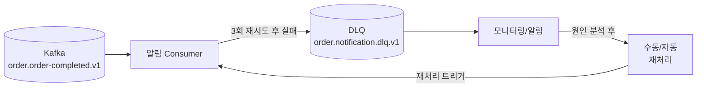

# Dead Letter Queue (DLQ)

## 왜 필요한가

핵심은 **"처리 실패한 메시지가 전체 파이프라인을 막지 않도록 격리"**하는 것이다.

Kafka Consumer는 파티션 내 offset 순서대로 메시지를 처리한다. 특정 메시지 처리가 계속 실패하면 해당 offset에서 멈추고 파티션 내 뒤의 메시지들이 쌓이기 시작한다. DLQ는 이런 "독성 메시지(Poison Pill)"를 별도 토픽으로 격리해 정상 메시지 처리를 계속하게 한다.

```
DLQ 없을 때:
  메시지 1 ✅ → 메시지 2 ✅ → 메시지 3 ❌ (계속 실패)
                                → 재시도 3회
                                → 재시도 3회
                                → 재시도 3회 ... 무한 반복
                                → Consumer Lag 무한 증가
                                → 메시지 4, 5, 6... 모두 대기

DLQ 있을 때:
  메시지 1 ✅ → 메시지 2 ✅ → 메시지 3 ❌
                                → 재시도 3회
                                → DLQ 토픽으로 격리
                                → 메시지 4 ✅ → 메시지 5 ✅ ... 정상 진행
```

> 쿠팡 Vitamin MQ(쿠팡 내부 메시지 큐 플랫폼)의 핵심 패턴: "실패 메시지 자동 전달, 서비스 복구 후 재처리"

---

## DLQ 처리 흐름



---

## 재시도 정책

### 재시도 횟수와 Backoff

```
즉시 재시도: 일시적 오류(네트워크 순단)에 효과적
지수 백오프: 외부 API 과부하, DB 연결 초과 시 효과적

예시:
  1회 재시도: 즉시
  2회 재시도: 1초 후
  3회 재시도: 4초 후
  → 최종 실패 → DLQ
```

### Spring Kafka 설정

Spring Kafka는 재시도와 DLQ 전달을 `DefaultErrorHandler` 하나로 설정한다.
- `DefaultErrorHandler`: Consumer 처리 실패 시 재시도 횟수와 간격을 제어하는 에러 핸들러
- `DeadLetterPublishingRecoverer`: 재시도를 모두 소진한 메시지를 지정한 DLQ 토픽으로 발행하는 컴포넌트

```java
@Bean
public DefaultErrorHandler errorHandler(KafkaTemplate<String, String> template) {
    // DLQ로 보낼 토픽 지정
    DeadLetterPublishingRecoverer recoverer =
        new DeadLetterPublishingRecoverer(template,
            (record, ex) -> new TopicPartition(
                // 네이밍 컨벤션: {domain}.{service}.dlq.v{n}
                // record.topic() + ".dlq" 자동 생성 방식은 컨벤션 불일치 → 직접 지정
                "order.notification.dlq.v1",
                record.partition()
            ));

    // 지수 백오프: 1초 시작, 2배씩 증가, 최대 10초, 최대 3회
    ExponentialBackOffWithMaxRetries backOff =
        new ExponentialBackOffWithMaxRetries(3);
    backOff.setInitialInterval(1_000L);
    backOff.setMultiplier(2.0);
    backOff.setMaxInterval(10_000L);

    return new DefaultErrorHandler(recoverer, backOff);
}
```

```yaml
# DLQ Consumer Group (별도 그룹으로 독립 소비)
spring:
  kafka:
    consumer:
      group-id: dev.order.notification.dlq-processor.v1
```

---

## DLQ는 논리적 개념이다

Kafka 브로커 입장에서 DLQ 토픽은 일반 토픽과 물리적으로 완전히 동일하다.

```
order.order-completed.v1   (일반 토픽)
order.notification.dlq.v1  (DLQ 토픽)

→ 둘 다 브로커 디스크에 파티션 디렉터리로 존재
→ 둘 다 .log Segment 파일에 메시지 저장
→ 둘 다 offset 기반으로 Consumer가 소비
→ Kafka 브로커는 "이게 DLQ다"를 전혀 모름
```

DLQ를 DLQ답게 만드는 것은 전부 애플리케이션과 운영 레벨의 약속이다:

| 레벨 | DLQ를 구성하는 것 |
|------|----------------|
| 네이밍 컨벤션 | `.dlq` suffix로 역할 식별 |
| 애플리케이션 | `DeadLetterPublishingRecoverer`가 실패 메시지를 이 토픽으로 전송 |
| 운영 | 이 토픽을 모니터링하고 재처리하는 별도 Consumer Group 운영 |

---

## DLQ 토픽 네이밍

```
원본 토픽:  {domain}.{event}.v{n}
DLQ 토픽:   {domain}.{service}.dlq.v{n}

예시:
  원본: order.order-completed.v1
  DLQ:  order.notification.dlq.v1
        order.shipping.dlq.v1
```

서비스별로 DLQ를 분리하는 이유: 알림 처리 실패와 배송 처리 실패는 원인과 재처리 방식이 다르다.

---

## 실패 유형별 처리 전략

| 실패 유형 | 예시 | 권장 처리 |
|-----------|------|-----------|
| **일시적 오류** | 네트워크 순단, DB 연결 초과 | 재시도 (Backoff) → 자동 복구 |
| **비즈니스 오류** | 존재하지 않는 주문ID | DLQ 격리 → 수동 확인 후 재처리 |
| **독성 메시지** | 역직렬화 실패, 스키마 불일치 | DLQ 격리 → 메시지 포맷 수정 후 재처리 |
| **외부 API 장애** | 이메일 서버 다운 | DLQ 격리 → 서비스 복구 후 배치 재처리 |

### 재시도하면 안 되는 케이스

```
❌ 재시도 금지:
  - 역직렬화 실패 (포맷 자체가 잘못됨)
  - 비즈니스 유효성 오류 (존재하지 않는 주문)
  → 즉시 DLQ로 보내고 재시도 낭비 방지

✅ 재시도 권장:
  - 네트워크 타임아웃
  - DB 연결 초과
  - 외부 API 503/429 응답
```

Spring Kafka에서 특정 예외는 재시도 없이 즉시 DLQ로:

```java
DefaultErrorHandler errorHandler = new DefaultErrorHandler(recoverer, backOff);

// 아래 예외는 재시도 없이 바로 DLQ
errorHandler.addNotRetryableExceptions(
    DeserializationException.class,     // 역직렬화 실패
    BusinessValidationException.class   // 비즈니스 유효성 오류
);
```

---

## DLQ 메시지 재처리

### 재처리 방식

```
1. 수동 재처리 (운영자)
   - Kafka CLI로 DLQ 메시지를 원본 토픽으로 재발행
   - 원인 파악 후 코드 수정 → 재처리

2. 자동 재처리 (DLQ Consumer)
   - DLQ 토픽을 별도 Consumer Group이 소비
   - 주기적으로 재처리 시도 (서비스 복구 후)

3. 배치 재처리
   - 외부 API 장애 복구 후 DLQ의 모든 메시지를 일괄 재처리
```

### DLQ Consumer 구현

```java
@KafkaListener(
    topics = "order.notification.dlq.v1",
    groupId = "dev.order.notification.dlq-processor.v1"
)
public void handleDlq(
        @Payload OrderCompletedEvent event,
        @Header(KafkaHeaders.RECEIVED_TOPIC) String topic,
        @Header(KafkaHeaders.EXCEPTION_MESSAGE) String errorMsg,
        Acknowledgment ack) {

    log.error("DLQ 메시지 수신 | topic={}, error={}, orderId={}",
        topic, errorMsg, event.getOrderId());

    // 멱등성 체크 후 재처리
    boolean isNew = processedEventService.tryMarkProcessed(
        event.getOrderId(), "DLQ"
    );
    if (!isNew) {
        log.warn("DLQ 중복 메시지 스킵: {}:DLQ", event.getOrderId());
        ack.acknowledge();
        return;
    }
    notificationService.send(event);
    ack.acknowledge();
}
```

---

## Consumer Lag와 DLQ의 관계

```
DLQ 없이 처리 실패가 반복되면:
  → Consumer가 같은 offset에서 멈춤
  → Producer는 계속 발행
  → Consumer Lag 급증
  → 모니터링 알림 발생

DLQ로 격리하면:
  → 실패 메시지를 건너뛰고 offset 전진
  → Consumer Lag 정상 유지
  → DLQ 토픽의 메시지 수 증가 → 별도 모니터링
```

> `consumer_lag = latest_offset - current_offset`
> (Producer가 마지막으로 발행한 위치 - Consumer가 마지막으로 처리한 위치 = 아직 처리 안 된 메시지 수)
> Consumer Lag이 갑자기 증가하면 DLQ 또는 처리 지연 여부를 먼저 확인한다.

---

## 트레이드오프: DLQ와 순서 보장

DLQ는 실패 메시지를 건너뛰고 offset을 전진시킨다. 이는 파티션 내 순서 보장을 의도적으로 포기하는 것이다.

**순서가 깨져도 괜찮은 경우 — 독립 이벤트 (이 PoC)**

```
파티션 0:
  offset 0: OrderCompleted(order-123) ← 알림 실패 → DLQ 격리
  offset 1: OrderCompleted(order-456) ← 다음 처리 → 문제없음
```

`order-123` 알림 실패와 `order-456` 알림 처리는 서로 의존성이 없다.
이벤트 간 순서 역전이 비즈니스 정합성에 영향을 미치지 않는다.

**순서가 깨지면 정합성이 파괴되는 경우 — 상태 전이(State Machine)**

```
파티션 0 (orderId 기반 Partition Key):
  offset 0: ORDER_CREATED(order-123)
  offset 1: ORDER_PAID(order-123)    ← 실패 → DLQ 격리
  offset 2: ORDER_SHIPPED(order-123) ← 처리됨
                                        → 결제 미확인 상태에서 배송 시작!
                                        → 비즈니스 정합성 파괴
```

상태 전이(State Machine) 구조에서는 각 단계가 이전 단계의 성공을 전제로 한다.
DLQ로 중간 단계를 건너뛰면 다음 단계가 잘못된 상태를 기반으로 처리된다.

**판단 기준:**

| 질문 | DLQ 적용 |
|------|---------|
| 파티션 내 메시지들이 서로 독립적인가? (다른 주문, 다른 사용자) | ✅ 안전 |
| 파티션 내 메시지들이 상태 전이(State Machine) 순서를 전제하는가? | ❌ 위험 — Saga / Circuit Breaker 고려 |

이 PoC는 Fan-out 구조(OrderCompleted 이벤트 하나를 독립적으로 소비)이므로 DLQ 적용이 안전하다.

---

## DLQ 동작 위치와 안티패턴

### DLQ는 Consumer가 살아있을 때만 동작한다

DLQ는 Consumer 내부에서 처리 실패 시 동작한다. Consumer 자체가 다운되면 DLQ로 가지 않고 메시지는 Kafka 파티션에 그대로 쌓인다.

```
Consumer 완전 다운:
  → 메시지가 Kafka 파티션에 쌓임 (Consumer Lag 급증)
  → DLQ로 이동하지 않음
  → Consumer 재시작 후 밀린 offset부터 이어서 처리

Consumer 살아있음 + 외부 API 다운:
  → Consumer가 메시지를 가져와 처리 시도
  → 외부 API 호출 실패 → 재시도 3회 → DLQ
  → 다음 메시지도 동일 원인으로 실패 → DLQ
  → 연쇄적으로 전부 DLQ 행
```

### 안티패턴: DLQ를 시스템 장애의 쓰레기통으로 사용

DLQ의 설계 의도는 **개별 독성 메시지(Poison Pill) 격리**다. 특정 데이터가 잘못됐거나 예외적인 케이스를 처리하기 위한 것이다.

그러나 DLQ가 존재한다는 이유로 시스템 장애를 방치하는 안티패턴이 발생한다:

```
❌ 안티패턴:
  외부 API 장애 → 모든 메시지 DLQ 행 → "DLQ가 받아주니까 괜찮네" → 방치
  → DLQ에 수천 건 쌓임 → 나중에 재처리 폭탄

✅ 올바른 대응:
  DLQ 유입 속도 모니터링 → 갑자기 대량 유입 시 즉시 알림
  → 원인 파악 (독성 메시지인가? 시스템 장애인가?)
  → 시스템 장애라면 DLQ가 아닌 근본 원인 해결
```

### DLQ 유입 패턴으로 원인 구분

| DLQ 유입 패턴 | 의미 | 대응 |
|-------------|------|------|
| 가끔 1~2개 | 개별 독성 메시지 | DLQ 재처리로 충분 |
| 갑자기 대량 유입 | 시스템 장애 신호 | 즉시 알림 + 근본 원인 조사 |

DLQ 메시지 수 모니터링이 베스트 프랙티스인 이유가 여기 있다. DLQ가 채워지는 **속도**를 감지하지 못하면 시스템 장애가 조용히 방치된다.

---

## Phase 2 구현 매핑

```yaml
# notification-service-async/application.yml
# 정상 Consumer와 DLQ Consumer는 같은 서비스 안에 공존
# group-id 기본값은 yml에 설정하되, @KafkaListener의 groupId 속성으로 개별 오버라이드
spring:
  kafka:
    consumer:
      group-id: dev.order.notification.event-consumer.v1  # 기본값
      enable-auto-commit: false
```

```java
// ErrorHandler Bean — 재시도 3회 후 DLQ
@Bean
public DefaultErrorHandler errorHandler(
        KafkaTemplate<String, String> template) {

    DeadLetterPublishingRecoverer recoverer =
        new DeadLetterPublishingRecoverer(template,
            (r, e) -> new TopicPartition("order.notification.dlq.v1", 0));

    ExponentialBackOffWithMaxRetries backOff =
        new ExponentialBackOffWithMaxRetries(3);
    backOff.setInitialInterval(1_000L);
    backOff.setMultiplier(2.0);

    DefaultErrorHandler handler = new DefaultErrorHandler(recoverer, backOff);
    handler.addNotRetryableExceptions(DeserializationException.class);
    return handler;
}
```

### PoC 구성 요약

| 항목 | 설정 | 이유 |
|------|------|------|
| DLQ 토픽 | `order.notification.dlq.v1` | 서비스별 분리 |
| 재시도 횟수 | 3회 | 일시적 오류 복구 기회 부여 |
| Backoff | 지수 백오프 (1s → 2s → 4s) | 외부 서비스 과부하 방지 |
| 즉시 DLQ | `DeserializationException` | 재시도 불가 오류 즉시 격리 |
| DLQ Consumer | 별도 Group (`dlq-processor.v1`) | 정상 처리와 독립 운영 |

---

## 참고 자료

- [Spring Kafka - Dead Letter Publishing](https://docs.spring.io/spring-kafka/docs/current/reference/html/#dead-letters)
- [Spring Kafka - Error Handling](https://docs.spring.io/spring-kafka/docs/current/reference/html/#error-handling)
- 쿠팡 Engineering Blog — Vitamin MQ DLQ 패턴
