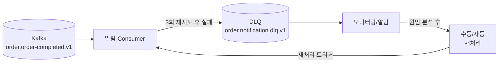

# Dead Letter Queue (DLQ)

## 왜 필요한가

핵심은 **"처리 실패한 메시지가 전체 파이프라인을 막지 않도록 격리"**하는 것이다.

Kafka Consumer는 offset 순서대로 메시지를 처리한다. 특정 메시지 처리가 계속 실패하면 해당 메시지에서 멈추고 뒤의 메시지들이 쌓이기 시작한다. DLQ는 이런 "독성 메시지(Poison Pill)"를 별도 토픽으로 격리해 정상 메시지 처리를 계속하게 한다.

```
DLQ 없을 때:
  메시지 1 ✅ → 메시지 2 ✅ → 메시지 3 ❌ (계속 실패)
                                → 재시도 3회
                                → 재시도 3회
                                → 재시도 3회 ... 무한 반복
                                → Consumer Lag 무한 증가
                                → 메시지 4, 5, 6... 모두 대기

DLQ 있을 때:
  메시지 1 ✅ → 메시지 2 ✅ → 메시지 3 ❌
                                → 재시도 3회
                                → DLQ 토픽으로 격리
                                → 메시지 4 ✅ → 메시지 5 ✅ ... 정상 진행
```

> 쿠팡 Vitamin MQ(쿠팡 내부 메시지 큐 플랫폼)의 핵심 패턴: "실패 메시지 자동 전달, 서비스 복구 후 재처리"

---

## DLQ 처리 흐름



---

## 재시도 정책

### 재시도 횟수와 Backoff

```
즉시 재시도: 일시적 오류(네트워크 순단)에 효과적
지수 백오프: 외부 API 과부하, DB 연결 초과 시 효과적

예시:
  1회 재시도: 즉시
  2회 재시도: 1초 후
  3회 재시도: 4초 후
  → 최종 실패 → DLQ
```

### Spring Kafka 설정

Spring Kafka는 재시도와 DLQ 전달을 `DefaultErrorHandler` 하나로 설정한다.
- `DefaultErrorHandler`: Consumer 처리 실패 시 재시도 횟수와 간격을 제어하는 에러 핸들러
- `DeadLetterPublishingRecoverer`: 재시도를 모두 소진한 메시지를 지정한 DLQ 토픽으로 발행하는 컴포넌트

```java
@Bean
public DefaultErrorHandler errorHandler(KafkaTemplate<String, String> template) {
    // DLQ로 보낼 토픽 지정
    DeadLetterPublishingRecoverer recoverer =
        new DeadLetterPublishingRecoverer(template,
            (record, ex) -> new TopicPartition(
                record.topic() + ".dlq", // 실패한 원본 토픽명 + ".dlq" 토픽으로 전송
                record.partition()       // 원본과 같은 파티션 번호 사용
            ));

    // 지수 백오프: 1초 시작, 2배씩 증가, 최대 10초, 최대 3회
    ExponentialBackOffWithMaxRetries backOff =
        new ExponentialBackOffWithMaxRetries(3);
    backOff.setInitialInterval(1_000L);
    backOff.setMultiplier(2.0);
    backOff.setMaxInterval(10_000L);

    return new DefaultErrorHandler(recoverer, backOff);
}
```

```yaml
# DLQ Consumer Group (별도 그룹으로 독립 소비)
spring:
  kafka:
    consumer:
      group-id: dev.order.notification.dlq-processor.v1
```

---

## DLQ 토픽 네이밍

```
원본 토픽:  {domain}.{event}.v{n}
DLQ 토픽:   {domain}.{service}.dlq.v{n}

예시:
  원본: order.order-completed.v1
  DLQ:  order.notification.dlq.v1
        order.shipping.dlq.v1
```

서비스별로 DLQ를 분리하는 이유: 알림 처리 실패와 배송 처리 실패는 원인과 재처리 방식이 다르다.

---

## 실패 유형별 처리 전략

| 실패 유형 | 예시 | 권장 처리 |
|-----------|------|-----------|
| **일시적 오류** | 네트워크 순단, DB 연결 초과 | 재시도 (Backoff) → 자동 복구 |
| **비즈니스 오류** | 존재하지 않는 주문ID | DLQ 격리 → 수동 확인 후 재처리 |
| **독성 메시지** | 역직렬화 실패, 스키마 불일치 | DLQ 격리 → 메시지 포맷 수정 후 재처리 |
| **외부 API 장애** | 이메일 서버 다운 | DLQ 격리 → 서비스 복구 후 배치 재처리 |

### 재시도하면 안 되는 케이스

```
❌ 재시도 금지:
  - 역직렬화 실패 (포맷 자체가 잘못됨)
  - 비즈니스 유효성 오류 (존재하지 않는 주문)
  → 즉시 DLQ로 보내고 재시도 낭비 방지

✅ 재시도 권장:
  - 네트워크 타임아웃
  - DB 연결 초과
  - 외부 API 503/429 응답
```

Spring Kafka에서 특정 예외는 재시도 없이 즉시 DLQ로:

```java
DefaultErrorHandler errorHandler = new DefaultErrorHandler(recoverer, backOff);

// 아래 예외는 재시도 없이 바로 DLQ
errorHandler.addNotRetryableExceptions(
    DeserializationException.class,     // 역직렬화 실패
    BusinessValidationException.class   // 비즈니스 유효성 오류
);
```

---

## DLQ 메시지 재처리

### 재처리 방식

```
1. 수동 재처리 (운영자)
   - Kafka CLI로 DLQ 메시지를 원본 토픽으로 재발행
   - 원인 파악 후 코드 수정 → 재처리

2. 자동 재처리 (DLQ Consumer)
   - DLQ 토픽을 별도 Consumer Group이 소비
   - 주기적으로 재처리 시도 (서비스 복구 후)

3. 배치 재처리
   - 외부 API 장애 복구 후 DLQ의 모든 메시지를 일괄 재처리
```

### DLQ Consumer 구현

```java
@KafkaListener(
    topics = "order.notification.dlq.v1",
    groupId = "dev.order.notification.dlq-processor.v1"
)
public void handleDlq(
        @Payload OrderCompletedEvent event,
        @Header(KafkaHeaders.RECEIVED_TOPIC) String topic,
        @Header(KafkaHeaders.EXCEPTION_MESSAGE) String errorMsg,
        Acknowledgment ack) {

    log.error("DLQ 메시지 수신 | topic={}, error={}, orderId={}",
        topic, errorMsg, event.getOrderId());

    // 멱등성 체크 후 재처리
    if (!processedEventService.isDuplicate(event.getOrderId() + ":DLQ")) {
        notificationService.send(event);
        processedEventService.markProcessed(event.getOrderId() + ":DLQ");
    }
    ack.acknowledge();
}
```

---

## Consumer Lag와 DLQ의 관계

```
DLQ 없이 처리 실패가 반복되면:
  → Consumer가 같은 offset에서 멈춤
  → Producer는 계속 발행
  → Consumer Lag 급증
  → 모니터링 알림 발생

DLQ로 격리하면:
  → 실패 메시지를 건너뛰고 offset 전진
  → Consumer Lag 정상 유지
  → DLQ 토픽의 메시지 수 증가 → 별도 모니터링
```

> `consumer_lag = latest_offset - current_offset`
> (Producer가 마지막으로 발행한 위치 - Consumer가 마지막으로 처리한 위치 = 아직 처리 안 된 메시지 수)
> Consumer Lag이 갑자기 증가하면 DLQ 또는 처리 지연 여부를 먼저 확인한다.

---

## Phase 2 구현 매핑

```yaml
# application.yml — DLQ 설정
spring:
  kafka:
    consumer:
      group-id: dev.order.notification.event-consumer.v1
      enable-auto-commit: false
```

```java
// ErrorHandler Bean — 재시도 3회 후 DLQ
@Bean
public DefaultErrorHandler errorHandler(
        KafkaTemplate<String, String> template) {

    DeadLetterPublishingRecoverer recoverer =
        new DeadLetterPublishingRecoverer(template,
            (r, e) -> new TopicPartition("order.notification.dlq.v1", 0));

    ExponentialBackOffWithMaxRetries backOff =
        new ExponentialBackOffWithMaxRetries(3);
    backOff.setInitialInterval(1_000L);
    backOff.setMultiplier(2.0);

    DefaultErrorHandler handler = new DefaultErrorHandler(recoverer, backOff);
    handler.addNotRetryableExceptions(DeserializationException.class);
    return handler;
}
```

### PoC 구성 요약

| 항목 | 설정 | 이유 |
|------|------|------|
| DLQ 토픽 | `order.notification.dlq.v1` | 서비스별 분리 |
| 재시도 횟수 | 3회 | 일시적 오류 복구 기회 부여 |
| Backoff | 지수 백오프 (1s → 2s → 4s) | 외부 서비스 과부하 방지 |
| 즉시 DLQ | `DeserializationException` | 재시도 불가 오류 즉시 격리 |
| DLQ Consumer | 별도 Group (`dlq-processor.v1`) | 정상 처리와 독립 운영 |

---

## 참고 자료

- [Spring Kafka - Dead Letter Publishing](https://docs.spring.io/spring-kafka/docs/current/reference/html/#dead-letters)
- [Spring Kafka - Error Handling](https://docs.spring.io/spring-kafka/docs/current/reference/html/#error-handling)
- 쿠팡 Engineering Blog — Vitamin MQ DLQ 패턴
