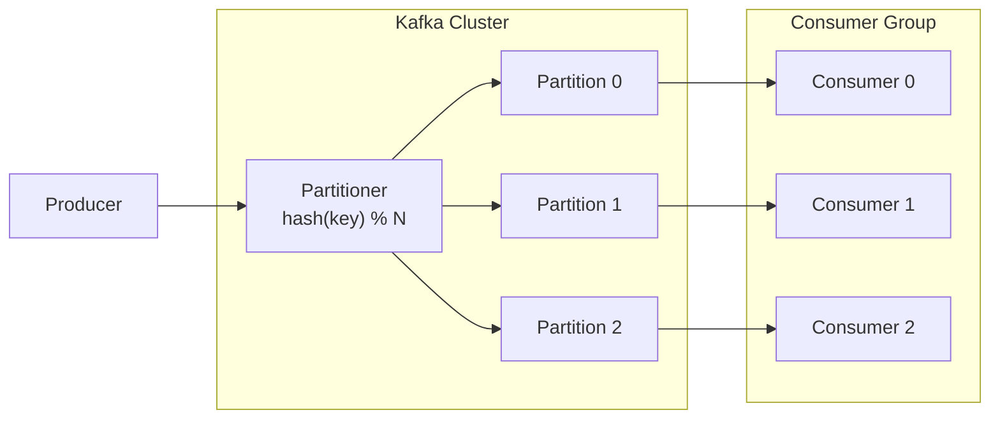
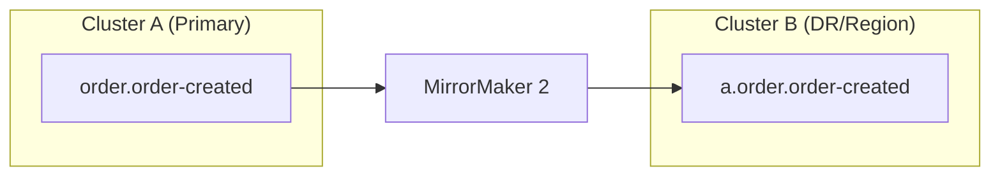

# Kafka 클러스터 인프라 학습 가이드

이 문서는 "Kafka 인프라를 어떤 순서로 이해하면 되는가"에 초점을 맞춘다.  
핵심은 다음 한 문장이다.

`Kafka = 분산 로그 저장소 + 복제 + 파티션 기반 병렬 처리`

## 1. 먼저 잡아야 할 큰 그림

Kafka 인프라를 이해할 때는 아래 질문 순서가 가장 학습 효율이 높다.

1. 데이터는 어디에 저장되는가? (Topic/Partition)
2. 장애가 나면 데이터는 어떻게 버티는가? (Replication)
3. 트래픽은 어떻게 분산되는가? (Partitioner/Consumer Group)
4. 언제 클러스터를 쪼개야 하는가? (격리/보안/리전)

이 순서로 보면 세부 설정값이 왜 필요한지 자연스럽게 연결된다.

## 2. 클러스터 구성요소

### Broker

- Kafka 서버 노드
- Partition 리더/팔로워를 저장하고 클라이언트 요청을 처리
- 여러 대를 묶어 클러스터를 구성

### Controller (KRaft 기준)

- 클러스터 메타데이터 관리
- 리더 선출, 토픽/파티션 변경사항 반영
- 과거 ZooKeeper 기반 대신 최근에는 KRaft 모드를 주로 사용

### Topic / Partition

- Topic: 이벤트 스트림의 논리적 이름
- Partition: 실제 병렬 처리와 저장 단위
- Partition 수가 처리량/병렬성 상한을 결정

## 3. 내구성 설정 핵심 3종

`replication.factor`, `acks`, `min.insync.replicas`는 함께 봐야 한다.

### replication.factor

- 토픽별 복제본 개수
- 값이 클수록 내구성은 좋아지고 저장/네트워크 비용은 증가

```
factor=1: 복제 없음, 브로커 장애 시 유실 가능
factor=2: 1대 장애 허용
factor=3: 운영에서 가장 흔한 기본값
```

### acks (Producer)

- `acks=0`: 전송만 하고 확인 안 받음 (가장 빠르나 유실 위험 큼)
- `acks=1`: 리더만 확인
- `acks=all`: ISR(In-Sync Replica) 기준으로 확인 (가장 안전)

### min.insync.replicas (Broker/Topic)

- `acks=all`일 때 최소 몇 개 복제본이 동기 상태여야 쓰기를 허용할지 결정
- 예: `replication.factor=3`, `min.insync.replicas=2`는 실무에서 자주 쓰는 조합

### 토픽 중요도별 예시

| 토픽 | 권장 복제 | 이유 |
|------|----------|------|
| `order.order-created` | 3 | 유실 시 주문 정합성 문제 |
| `payment.payment-completed` | 3 | 금전 데이터 |
| `user.click-event` | 1~2 | 일부 유실 허용 가능 |
| dev/test 토픽 | 1 | 비용 최소화 |

원칙은 단순하다. "모든 토픽 고내구성"이 아니라 "비즈니스 임팩트 기반 차등 적용"이다.

## 4. 클러스터 토폴로지: 보통은 단일로 시작

### 기본 전략

대부분은 단일 Kafka 클러스터 + 토픽 네이밍 분리로 시작한다.

```
{domain}.{event}.{version}
order.order-created.v1
payment.payment-completed.v1
inventory.stock-decreased.v1
```

이 방식이 기본인 이유:

- 운영 복잡도(모니터링/보안/업그레이드)를 최소화
- 클러스터 수 증가에 따른 운영비 급증 방지
- 초기 단계에서 용량 계획과 장애 대응이 단순

### 분리 시점

아래 조건 중 하나가 강하면 별도 클러스터를 검토한다.

- 도메인별 트래픽 편차가 매우 큼 (hot domain 격리 필요)
- 보안/컴플라이언스 상 물리 분리가 필요
- 장애 전파 차단이 최우선인 핵심 도메인
- 리전 단위 분리 운영이 필요

## 5. Kafka에 게이트웨이가 없는 이유

Kafka는 API Gateway 같은 중앙 라우터 없이도 자체 분산이 동작한다.

- Producer가 Partitioner로 대상 Partition 결정
- Broker가 Partition 리더를 통해 쓰기/읽기 처리
- Consumer Group이 Partition을 나눠 가져가며 병렬 소비



즉, 분산/로드밸런싱이 Kafka 내부 모델에 내장되어 있다.

## 6. 운영에서 자주 놓치는 인프라 포인트

### 스토리지/보관 정책

- Kafka는 디스크 기반 로그 저장소다.
- `retention.ms`, `retention.bytes`, `segment.bytes`를 트래픽 특성에 맞게 조정해야 한다.
- 복제 수가 늘수록 디스크 요구량이 거의 배수로 증가한다.

### 모니터링

최소한 아래 지표는 상시 관찰한다.

- Consumer Lag
- Under-replicated partitions
- Broker 디스크 사용률/IO
- Produce/Fetch 지연 시간

### 보안

- 인증: SASL
- 암호화: TLS
- 권한: ACL

PoC 단계에서도 인증/권한 모델은 초기에 방향을 정해두는 편이 좋다.

## 7. 멀티 클러스터 복제: MirrorMaker 2

클러스터가 둘 이상이면 데이터 동기화가 필요해지고, 대표 수단이 MirrorMaker 2(MM2)다.



주요 사용 사례:

- 멀티 리전 복제
- DR(재해복구) 대기 클러스터 운영
- 단일 클러스터에서 분리 클러스터로 점진 마이그레이션

현재 PoC 범위에서는 단일 클러스터/단일 리전이면 충분하다.

## 참고 자료

- [Kafka Replication](https://kafka.apache.org/documentation/#replication)
- [Kafka Georeplication (MirrorMaker 2)](https://kafka.apache.org/documentation/#georeplication)
- [Kafka Configuration](https://kafka.apache.org/documentation/#configuration)
