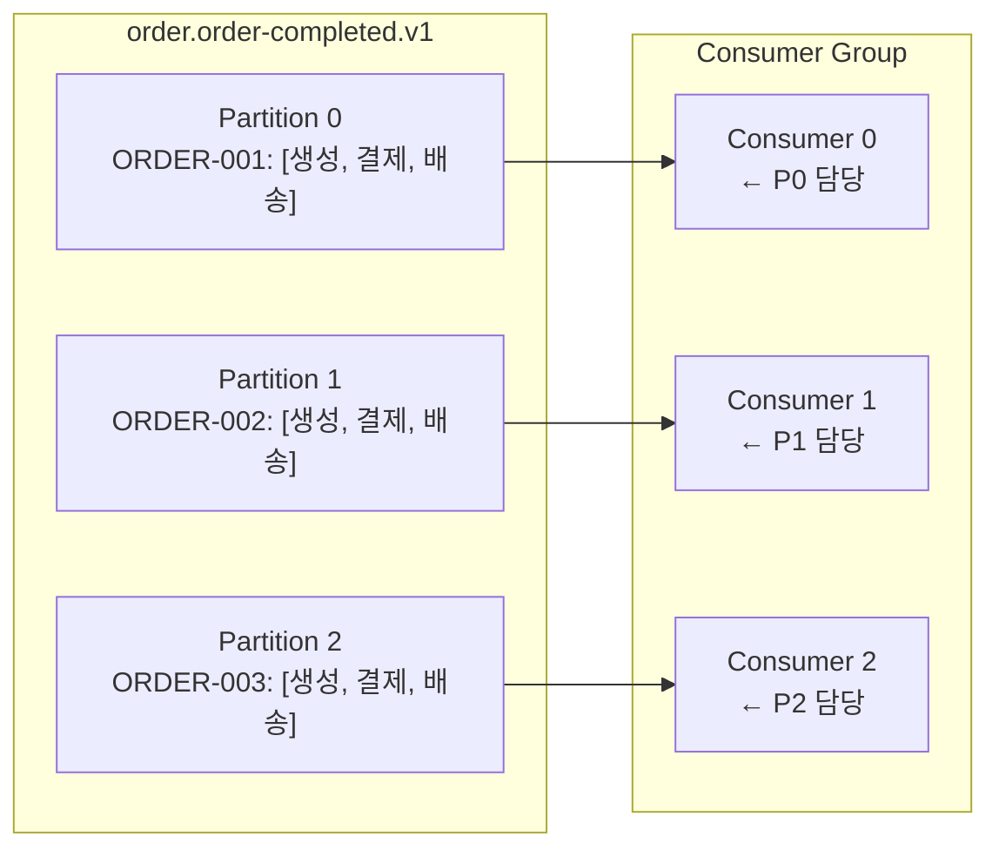

# Partition Key

## 왜 필요한가

핵심은 **"같은 키의 메시지는 항상 같은 파티션으로 → 파티션 내 순서 보장"**이다.

Partition Key 없이 메시지를 발행하면 Kafka는 라운드 로빈으로 파티션에 분산한다. 각 파티션은 독립적으로 소비되므로 파티션 간 순서는 보장되지 않는다.

```
Partition Key 없음 (라운드 로빈):
  주문 A - 생성     → Partition 0
  주문 A - 결제완료  → Partition 1
  주문 A - 배송시작  → Partition 2

  Consumer가 P1을 P0보다 먼저 처리하면:
  → "결제완료" 처리 후 "생성" 처리 → 순서 역전

Partition Key = orderId:
  주문 A - 생성     → Partition 0 (hash("A") % 3 = 0)
  주문 A - 결제완료  → Partition 0
  주문 A - 배송시작  → Partition 0
  → Partition 0 내에서 순서 보장
```

> 배민: 주문별 이벤트 순서 유지를 위해 orderId를 Partition Key로 사용

---

## Partition Key 결정 원리

Kafka Producer는 Partition Key의 해시값으로 파티션을 결정한다.

```
partitionIndex = hash(key) % partitionCount

예) partitionCount = 3
  hash("ORDER-001") % 3 = 1  → Partition 1 고정
  hash("ORDER-002") % 3 = 0  → Partition 0 고정
  hash("ORDER-003") % 3 = 2  → Partition 2 고정
```

같은 Key는 항상 같은 파티션으로 → 파티션 내 offset 순서 보장 → Consumer가 순서대로 처리.

---

## 순서 보장 범위

```
보장됨:
  같은 Key (같은 파티션) 내에서 메시지 순서

보장 안 됨:
  다른 Key (다른 파티션) 간 메시지 순서
  → 각 파티션은 독립적으로 Consumer에게 할당되므로
```



Consumer 0은 ORDER-001의 [생성 → 결제 → 배송] 순서를 보장하며 처리한다.
Consumer 0과 Consumer 1 간의 처리 순서는 보장되지 않는다.

---

## Partition Key 선택 기준

### 좋은 Partition Key

```
orderId    → 주문 이벤트 순서 보장
userId     → 사용자별 이벤트 순서 보장
sessionId  → 세션 이벤트 순서 보장
```

**기준:** 순서가 중요한 이벤트들이 "같은 단위"로 묶여야 하는 식별자.

### 나쁜 Partition Key

```
❌ null (Key 없음)
  → 라운드 로빈 → 순서 미보장

❌ 고정값 ("all", "default")
  → 모든 메시지가 하나의 파티션으로 → 처리 병렬성 0

❌ 타임스탬프
  → 분산은 되지만 같은 주문의 이벤트가 다른 파티션으로 분산될 수 있음
  → 순서 보장 불가
```

### 핫 파티션 주의

```
❌ 문제:
  인기 상품 ID를 Key로 사용 시
  → 특정 상품의 주문이 폭발적으로 증가
  → 해당 파티션만 과부하
  → 다른 파티션은 한가 → 불균형

✅ 해결:
  복합 Key: productId + suffix (productId + 0~N 범위로 분산)
  또는 순서가 필요 없다면 Key를 사용하지 않음
```

---

## 배민 사례: 주문별 이벤트 순서 유지

배달의민족은 주문 프로세스에서 **이벤트 순서가 비즈니스 정합성에 직결**되기 때문에 orderId를 Partition Key로 사용한다.

```
주문 완료 흐름:
  OrderCreated → OrderPaid → OrderDispatched → OrderDelivered

orderId = "ORDER-12345"를 Key로 사용:
  → 모든 이벤트가 동일 파티션으로
  → Consumer가 순서대로 처리
  → 재고 차감, 결제 처리, 배송 시작이 순서 보장

만약 순서 역전 시:
  OrderDelivered를 OrderCreated 전에 처리
  → 배송 완료됐는데 주문이 없음 → 정합성 오류
```

---

## Partition Key와 파티션 수의 관계

```
파티션 수 변경 전:
  hash("ORDER-001") % 3 = 1  → Partition 1

파티션 수를 3 → 5로 변경 후:
  hash("ORDER-001") % 5 = 3  → Partition 3  ← 다른 파티션!
```

파티션 수를 늘리면 기존 Key의 파티션 배정이 바뀐다. 처리 중인 메시지가 있다면 순서 보장이 깨질 수 있다. 파티션 수는 처음에 충분히 여유 있게 설정하고 가급적 변경하지 않는 것이 좋다.

> `topic-partition.md` — 파티션 수를 줄일 수 없는 이유 참조.

---

## Phase 2 구현 매핑

```java
// Producer: orderId를 Partition Key로 발행
@Service
public class OrderEventPublisher {

    private final KafkaTemplate<String, OrderCompletedEvent> kafkaTemplate;

    public void publish(OrderCompletedEvent event) {
        kafkaTemplate.send(
            "order.order-completed.v1",
            event.getOrderId(),   // ← Partition Key
            event
        );
    }
}
```

```java
// Consumer: 파티션 내 순서대로 수신됨
@KafkaListener(
    topics = "order.order-completed.v1",
    groupId = "dev.order.notification.event-consumer.v1"
)
public void handle(@Payload OrderCompletedEvent event, Acknowledgment ack) {
    // 같은 orderId의 이벤트는 항상 이 Consumer가 순서대로 처리
    notificationService.send(event);
    ack.acknowledge();
}
```

### PoC 구성 요약

| 항목 | 설정 | 이유 |
|------|------|------|
| Partition Key | `orderId` | 주문별 이벤트 순서 보장 |
| 파티션 수 | `3` (Phase 2 기본값) | Consumer 3개와 1:1 매핑 가능 |
| Key 없는 경우 | 라운드 로빈 | 순서가 필요 없는 이벤트에 사용 |

---

## 참고 자료

- [Kafka Producer - Partitioning](https://kafka.apache.org/documentation/#producerconfigs_partitioner.class)
- [Kafka Message Keys](https://kafka.apache.org/documentation/#intro_topics)
- 배달의민족 WOOWACON 2024 — 주문 플랫폼 이벤트 순서 보장 사례
