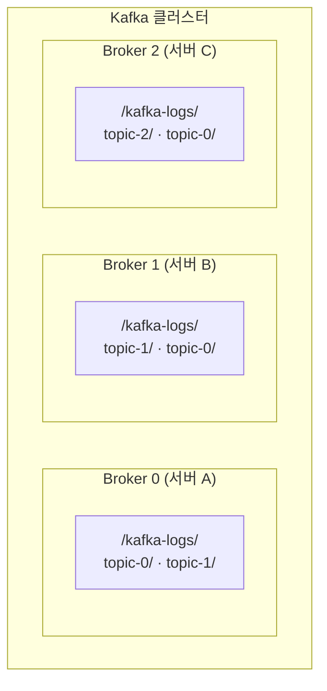
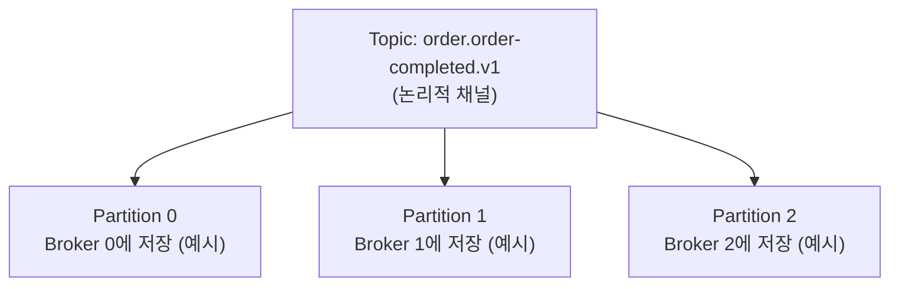
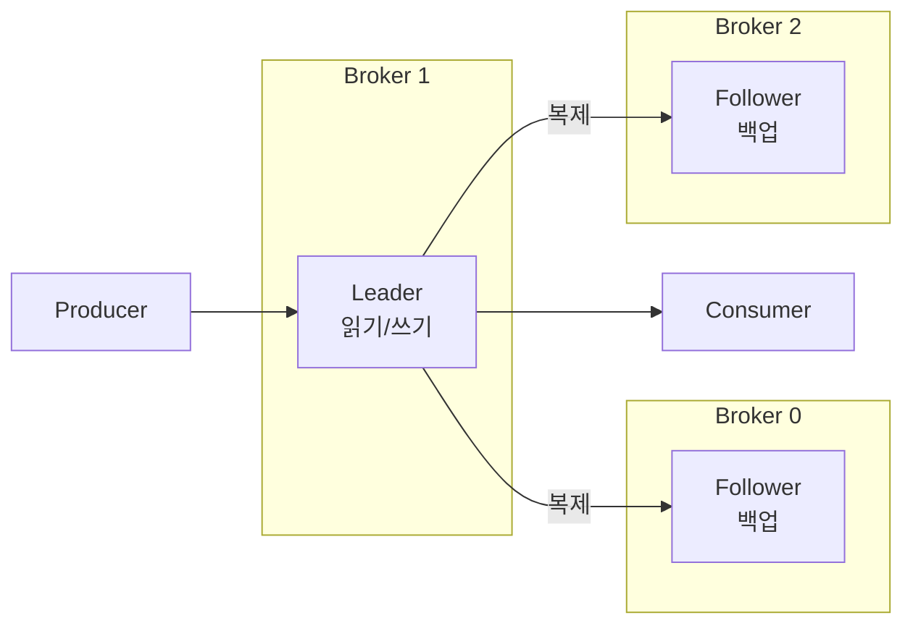
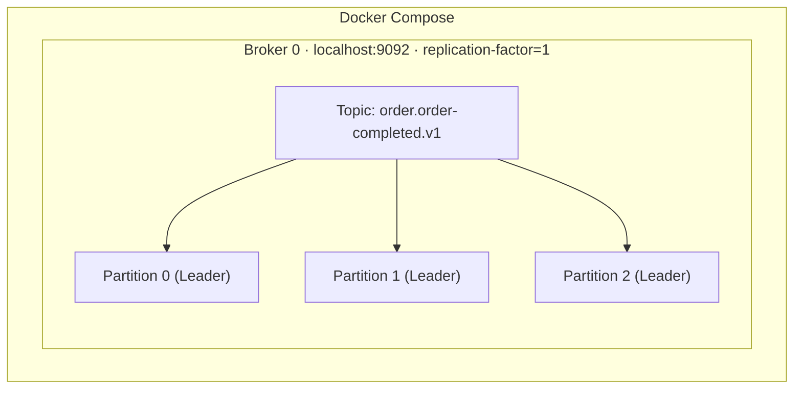
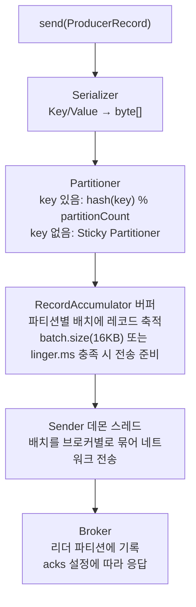
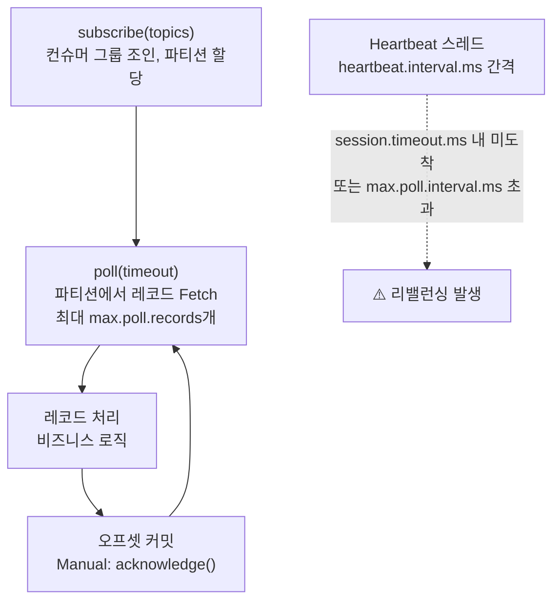
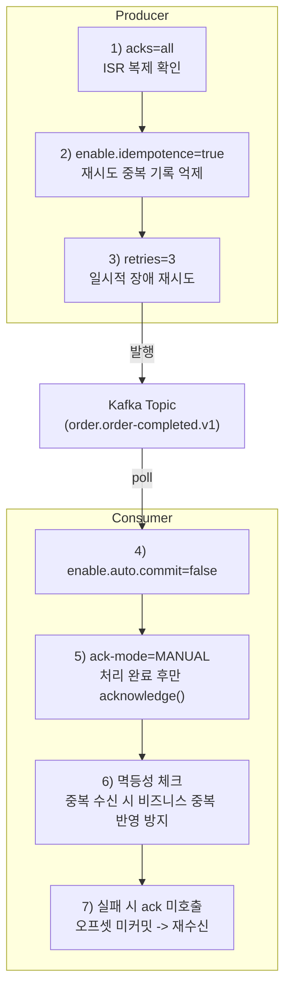

# Producer / Consumer

## 왜 필요한가

이벤트 기반 아키텍처의 기본 단위. Producer가 이벤트를 발행하고 Consumer가 구독하는 구조가 없으면 서비스 간 비동기 통신 자체가 불가능하다. 이번 PoC에서 order-service-async가 Producer, inventory-service-async가 Consumer 역할을 한다.

---

## 선행 지식: Kafka 클러스터의 물리/논리 구조

Producer/Consumer를 이해하려면 메시지가 **물리적으로 어디에 저장되는지** 먼저 알아야 한다.

### 물리적 구조: Broker = 서버



- **Broker** = Kafka 프로세스가 실행되는 서버 1대. 클러스터는 여러 Broker의 집합이다.
- 각 Broker는 디스크에 로그 파일로 메시지를 저장한다.
- PoC에서는 Docker Compose로 Broker 1대를 실행한다 (프로덕션에서는 보통 3대 이상).

### 논리적 구조: Topic > Partition



> **주의:** 위 다이어그램은 파티션 3개가 브로커 3대에 1:1로 분배된 예시다. 실제로는 **브로커 1대가 여러 파티션을 담을 수 있다.** 파티션 수가 브로커 수보다 많으면 한 브로커가 여러 파티션을 가지며, 여러 토픽의 파티션이 섞여서 저장된다.
>
> 예: Broker 0 한 대가 `order.order-completed.v1/P0`, `order.order-completed.v1/P2`, `payment.payment-events.v1/P1` 등을 동시에 보유 가능.

각 Partition 내부는 Producer가 발행한 메시지가 도착한 순서대로 쌓이는 append-only 로그다:

```
Partition 0:  [msg0] → [msg1] → [msg2]
               offset0   offset1   offset2

Partition 1:  [msg0] → [msg1]
               offset0   offset1

Partition 2:  [msg0] → [msg1] → [msg2] → [msg3]
               offset0   offset1   offset2   offset3
```

- **메시지** = Producer가 `send()`로 발행한 데이터 1건. 이번 PoC에서는 `OrderCompletedEvent` JSON이 메시지 하나다. Partition에 저장될 때 key, value, timestamp, header로 구성된다.
- **Topic** = 메시지의 논리적 채널 (우편함 이름). 예: `order.order-completed.v1`.
- **Partition** = Topic을 물리적으로 쪼갠 단위. 각 Partition은 **하나의 Broker**에 저장된다. 단, Broker 1대는 여러 Partition을 담을 수 있다.
- **Offset** = Partition 내에서 메시지의 순번 (0, 1, 2, ...). **Partition 안에서만** 순서가 보장된다.

### "같은 파티션"의 의미

```
Producer가 key="order-123"으로 메시지 3건 발행:

  hash("order-123") % 3 = 1  → 모두 Partition 1로 간다

  Partition 1 (Broker 1의 디스크):
  [order-123 생성] → [order-123 결제] → [order-123 배송]
   offset 0           offset 1           offset 2

  → 같은 파티션 = 같은 서버의 같은 로그 파일에 순서대로 기록됨
  → 이 순서는 Consumer가 읽을 때도 보장됨
```

**"같은 파티션"이란:**
- 물리적으로: **같은 Broker(서버)의 같은 로그 파일**에 append된다
- 논리적으로: **offset 순서가 보장**된다 (먼저 쓴 메시지가 먼저 읽힌다)
- 실용적으로: 같은 주문(key)의 이벤트를 순서대로 처리해야 할 때 같은 파티션으로 보낸다

### 복제 (Replication)

Topic: "order.order-completed.v1", Partition 1, replication-factor=3



- 각 Partition에는 **Leader** 1개 + **Follower** N개가 있다.
- Producer/Consumer는 **Leader에만** 읽기/쓰기한다.
- Follower는 Leader를 복제하여 장애에 대비한다.
- **ISR (In-Sync Replica):** Leader와 동기화가 완료된 Follower 집합. `acks=all`은 ISR 전체 복제 완료를 기다린다.
- **replication.factor는 토픽별로 설정 가능하다.** 주문/결제처럼 손실이 치명적인 토픽은 3, 클릭 로그처럼 유실을 허용할 수 있는 토픽은 1~2로 낮춰 자원을 절약한다.

### PoC에서의 구성



PoC에서는 Broker 1대이므로 모든 Partition이 같은 서버에 있고 복제도 없다. 하지만 Partition 간 순서 미보장, Partition 내 순서 보장이라는 논리적 특성은 동일하게 동작한다.

---

## Producer: 메시지 발행 흐름



**핵심:** `send()`는 비동기. 호출 즉시 `Future<RecordMetadata>`를 반환하며, 실제 전송은 Sender 스레드가 담당한다.

### acks 설정

| 설정 | 동작 | 성능 | 내구성 |
|------|------|------|--------|
| **acks=0** | 응답 안 기다림 (Fire & Forget) | 최고 | 최저 — 리더 장애 시 유실 |
| **acks=1** | 리더가 로컬 기록 후 응답 | 중간 | 중간 — 팔로워 복제 전 장애 시 유실 |
| **acks=all** | 모든 ISR 복제 완료 후 응답 | 최저 | 최고 — ISR 전체 장애 아니면 유실 없음 |

**acks=all 사용 시 반드시 함께 설정:**
- `min.insync.replicas=2` (브로커): ISR 최소 2개 이상이어야 쓰기 허용. 1이면 acks=all이어도 리더 혼자 응답 가능 → acks=1과 동일해짐.

### PoC 선택: acks=all

At Least Once 보장의 첫 번째 고리. 메시지가 ISR에 모두 복제됨을 확인해야 유실을 원천 차단할 수 있다.

---

## Consumer: poll 메커니즘



Consumer는 `poll()`을 주기적으로 호출해 데이터를 pull하며, 처리 후 오프셋을 커밋하고 다시 `poll()`을 반복한다.

### 핵심 설정값 관계

```
(max.poll.records × 레코드당 처리 시간) < max.poll.interval.ms
```

이 부등식이 깨지면 브로커가 Consumer를 죽은 것으로 판단 → 리밸런싱 발생.

`max.poll.interval.ms`는 poll 주기가 아니라 "두 poll 호출 사이의 최대 허용 시간"이다.  
즉 Consumer는 보통 매우 짧은 간격으로 계속 poll을 호출하고, 데이터가 없으면 빈 결과를 받아 루프를 유지한다.

| 설정 | 기본값 | 역할 |
|------|--------|------|
| max.poll.interval.ms | 300,000 (5분) | 두 poll() 사이 최대 허용 시간. 초과 시 리밸런싱 |
| max.poll.records | 500 | poll() 한 번에 반환하는 최대 레코드 수 |
| session.timeout.ms | 45,000 (45초) | Heartbeat 기반 세션 타임아웃 |
| heartbeat.interval.ms | 3,000 (3초) | Heartbeat 전송 간격. session.timeout.ms의 1/3 이하 권장 |

### 사람인 장애 사례 — max.poll.interval.ms 초과

**상황:** DB 쿼리가 건당 1.5~2분, 기본 설정(max.poll.records=500) → 500개 × 1.5분 = 750분 >> 5분 타임아웃. 브로커가 Consumer를 죽은 것으로 판단, 리밸런싱 반복 → 커밋 안 된 오프셋부터 재소비 → 중복 처리.

**해결:** `max.poll.records=2`, `max.poll.interval.ms=600000`으로 조정.

**교훈:** Kafka 기본 설정을 그대로 쓰면 위험하다. 비즈니스 로직 처리 시간에 맞춰 반드시 튜닝해야 한다.

---

## Offset Commit

Consumer가 "어디까지 읽었는지" 기록하는 메커니즘. `__consumer_offsets` 토픽에 저장된다.

### Auto Commit vs Manual Commit

| 항목 | Auto Commit | Manual Commit |
|------|-------------|---------------|
| 설정 | `enable.auto.commit=true` (기본값) | `enable.auto.commit=false` |
| 커밋 시점 | `auto.commit.interval.ms` 간격 (5초) | 애플리케이션이 명시적 호출 |
| 제어 수준 | 낮음 | 높음 |

### Auto Commit의 위험성

**유실 시나리오:**
```
poll() → 오프셋 1000까지 수신
  → 500까지 처리 완료
  → auto commit 타이머 → 오프셋 1000 커밋 (501~1000 미처리인데 커밋됨)
  → Consumer 크래시
  → 재시작 후 1001부터 소비 → 501~1000 유실
```

**중복 시나리오:**
```
poll() → 오프셋 1000까지 수신
  → 1000까지 처리 완료
  → auto commit 전에 Consumer 크래시
  → 재시작 후 마지막 커밋(500)부터 재소비 → 501~1000 중복 처리
```

**결론:** Auto commit은 유실과 중복 모두 발생 가능. Manual commit으로 "처리 완료 후 커밋"을 보장해야 유실을 방지할 수 있다.

### Spring Kafka AckMode

Spring Kafka에서 `AckMode`는 "`enable.auto.commit=false`일 때 오프셋을 언제 커밋할지"를 정하는 정책이다.

여기서 커밋을 실제로 수행하는 주체는 Spring Kafka 리스너 컨테이너다.  
리스너 컨테이너는 `@KafkaListener`를 감싸서 `poll -> 리스너 실행 -> 커밋/재시도/에러처리` 흐름을 관리한다.

### AckMode 전체 맵

먼저 전체 모드를 한 번에 보면 아래와 같다.

| AckMode | 커밋 시점 | 요약 |
|---------|-----------|------|
| **RECORD** | 레코드 1건 처리 직후 | 가장 세밀하지만 커밋 빈도가 높음 |
| **BATCH** (기본값) | `poll()`로 받은 배치 전체 처리 후 | 단순하고 운영 친화적인 기본 선택 |
| **MANUAL** | `acknowledge()` 호출 후 컨테이너 커밋 타이밍에 반영 | 처리 완료 기준을 코드로 직접 제어 |
| **MANUAL_IMMEDIATE** | `acknowledge()` 호출 시 즉시 커밋 시도 | 즉시 오프셋 반영이 필요한 특수 케이스 |

### 핵심 비교: BATCH vs MANUAL

실무에서 가장 중요한 선택은 `BATCH`와 `MANUAL`이다.

| 항목 | BATCH | MANUAL |
|------|-------|--------|
| 기본 동작 | `poll()`로 받은 배치 전체 처리 후 컨테이너가 커밋 | 코드에서 `acknowledge()`를 호출한 지점까지만 커밋 대상 |
| 커밋 시점 제어 | 컨테이너가 결정 | 애플리케이션이 결정 |
| 장점 | 단순하고 운영 부담이 낮음 | 비즈니스 완료 기준(조건부 성공/부분 성공)을 코드로 명시 가능 |
| 단점 | 도메인별 세밀 제어가 어려움 | 코드 복잡도 증가, ack 누락 시 재처리 증가 |

`poll()`에서 100건을 받아온 경우:

1. `BATCH`: 100건 리스너 처리 완료 후 배치 단위 커밋
2. `MANUAL`: 각 레코드/조건별로 `acknowledge()` 호출한 지점까지만 커밋

### BATCH와 auto commit은 다르다

- `BATCH`: 리스너 처리 완료와 커밋이 연동됨
- `enable.auto.commit=true`: 처리 완료 여부와 무관하게 주기(`auto.commit.interval.ms`)로 커밋됨

그래서 실무에서는 `enable.auto.commit=false` + AckMode를 기본으로 사용한다.

### MANUAL이 At Least Once와 연결되는 이유

At Least Once의 핵심은 "처리 성공 전에는 커밋하지 않는다"이다.

- 처리 성공 후 `acknowledge()` 호출 -> 오프셋 커밋 -> 다음 메시지로 진행
- 처리 실패 시 `acknowledge()` 미호출 -> 오프셋 미커밋 -> 재시작/리밸런싱 후 다시 수신

즉 `MANUAL`은 "처리 완료 시점 = 커밋 기준"을 코드로 강제할 수 있어서 At Least Once 구현에 유리하다.

참고로 `MANUAL_IMMEDIATE`는 ack 시점 즉시 커밋이 필요한 특수 케이스에서 선택하며, 일반적인 핵심 비교 축은 `BATCH` vs `MANUAL`이다.

### 실무 선택 가이드: BATCH vs MANUAL

| 상황 | 권장 AckMode | 이유 |
|------|--------------|------|
| 메일 발송/알림 전송처럼 단순 후처리 (실패 시 재시도 정책으로 흡수 가능) | **BATCH** | 운영 단순성, 코드 복잡도 최소화 |
| 주문 상태 변경/재고 차감처럼 후속 비즈니스 프로세스 정합성이 중요한 처리 | **MANUAL** | 성공 메시지만 커밋하도록 도메인 기준 제어 가능 |

보충:

- `BATCH`는 메시지별 비즈니스 성공/실패에 따라 커밋 대상을 세밀하게 분리하기 어렵다.
- `MANUAL`은 성공한 메시지에서만 `acknowledge()`를 호출해 커밋 범위를 직접 통제할 수 있다.

### PoC 선택: MANUAL

At Least Once의 두 번째 고리로 `MANUAL`을 사용한다.  
비즈니스 로직 완료 후에만 `acknowledge()`를 호출해 커밋하고, 실패하면 커밋하지 않아 재수신되도록 한다.

---

## Phase 2 구현 매핑

### 설정 (application.yml)

```yaml
spring:
  kafka:
    bootstrap-servers: localhost:9092

    producer:
      acks: all                          # At Least Once 첫 번째 고리
      key-serializer: org.apache.kafka.common.serialization.StringSerializer
      value-serializer: org.springframework.kafka.support.serializer.JsonSerializer
      retries: 3
      properties:
        enable.idempotence: true         # Producer 재시도 시 브로커 레벨 중복 방지

    consumer:
      group-id: dev.order.notification.event-consumer.v1  # {env}.{domain}.{service}.{purpose}.v{n}
      auto-offset-reset: earliest        # 최초 소비 시 처음부터
      enable-auto-commit: false          # Spring Kafka AckMode 사용
      key-deserializer: org.apache.kafka.common.serialization.StringDeserializer
      value-deserializer: org.springframework.kafka.support.serializer.JsonDeserializer
      properties:
        spring.json.trusted.packages: "*"
        max.poll.records: 10             # 사람인 교훈 — 작게 설정

    listener:
      ack-mode: MANUAL                   # At Least Once 두 번째 고리
      concurrency: 3                     # 파티션 수에 맞춰 조정
```

### Producer 멱등성 vs Consumer 멱등성

둘 다 "중복 문제 대응"이지만 해결하는 레이어가 다르다.

| 구분 | Producer 멱등성 (`enable.idempotence=true`) | Consumer 멱등 처리 |
|------|----------------------------------------------|--------------------|
| 목적 | Producer 재시도 중 브로커에 중복 기록되는 메시지 억제 | 중복 수신되더라도 비즈니스 결과를 한 번만 반영 |
| 범위 | Producer -> Kafka 기록 구간 | Kafka -> 애플리케이션 처리 구간 |
| 대체 가능성 | Consumer 멱등성을 완전히 대체하지 못함 | Producer 중복 기록 억제를 대체하지 못함 |

정리:

- 순수 비즈니스 정합성만 보면 Consumer 멱등성이 핵심이다.
- 다만 Producer 멱등성도 함께 사용하면 중복 기록/재시도 혼선을 줄여 운영 안정성에 유리하다.

### Producer 코드 (order-service-async)

```java
@Service
@RequiredArgsConstructor
public class OrderEventProducer {

    private final KafkaTemplate<String, OrderCompletedEvent> kafkaTemplate;

    public void publishOrderCompleted(OrderCompletedEvent event) {
        kafkaTemplate.send(
            "order.order-completed.v1",  // topic
            event.getOrderId(),      // key → 주문별 같은 파티션 → 순서 보장
            event                    // value
        ).whenComplete((result, ex) -> {
            if (ex != null) {
                log.error("발행 실패: orderId={}", event.getOrderId(), ex);
                return;
            }

            var md = result.getRecordMetadata();
            log.debug(
                "발행 성공: topic={}, partition={}, offset={}, orderId={}",
                md.topic(),
                md.partition(),
                md.offset(),
                event.getOrderId()
            );
        });
    }
}
```

### Consumer 코드 (inventory-service-async)

```java
@Service
public class NotificationEventConsumer {

    @KafkaListener(topics = "order.order-completed.v1", groupId = "dev.order.notification.event-consumer.v1")
    public void handleOrderCompleted(
            @Payload OrderCompletedEvent event,
            Acknowledgment acknowledgment) {
        try {
            // 멱등성 체크 (At Least Once → 중복 수신 가능)
            if (isAlreadyProcessed(event.getEventId())) {
                acknowledgment.acknowledge();
                return;
            }

            // 비즈니스 로직
            sendNotification(event);

            // 처리 완료 후 커밋
            acknowledgment.acknowledge();

        } catch (Exception e) {
            // acknowledge() 미호출 → 다음 poll에서 재수신
            log.error("처리 실패: orderId={}", event.getOrderId(), e);
        }
    }
}
```

### At Least Once 보장 체인 요약



---

## 참고 자료

- [Kafka Producer Internals](https://www.automq.com/blog/understand-kafka-producer-in-one-article)
- [Kafka Acknowledgment Settings (acks)](https://dattell.com/data-architecture-blog/kafka-acknowledgment-settings-explained-acks01all/)
- [Spring Kafka AckMode API](https://docs.spring.io/spring-kafka/api/org/springframework/kafka/listener/ContainerProperties.AckMode.html)
- [사람인: Kafka 설정을 사용한 문제해결](https://saramin.github.io/2019-09-17-kafka/)
- [How Kafka's Auto Commit Can Lead to Data Loss](https://newrelic.com/blog/best-practices/kafka-consumer-config-auto-commit-data-loss)
