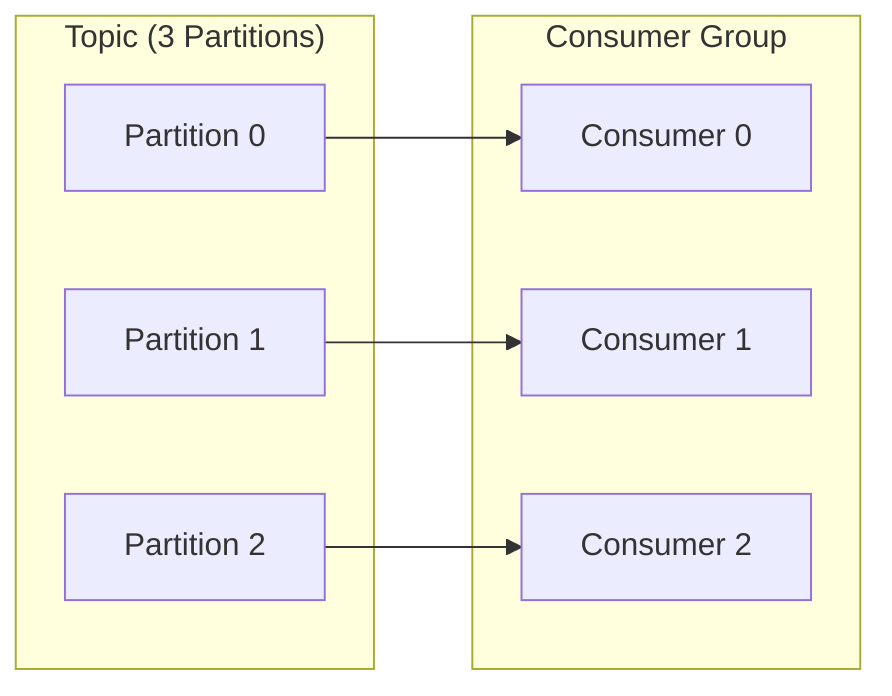
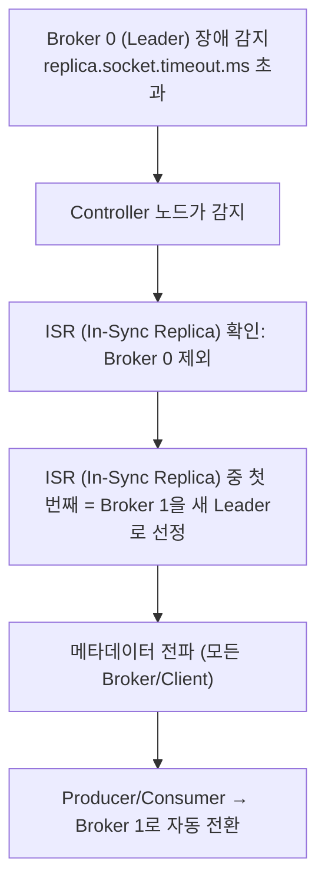

# Topic / Partition

## 왜 필요한가

Topic은 메시지를 종류별로 구분하고, Partition은 그 메시지를 여러 곳에 분산 저장하여 병렬 처리를 가능하게 한다. Partition이 없으면 Kafka는 단일 로그 파일에 메시지를 순서대로만 쌓는 큐와 다를 바 없다. Partition이 있어야 Consumer 여러 개가 동시에 처리할 수 있고, 처리량이 수평 확장된다.

> Producer/Consumer의 기본 구조, offset 개념, hash(key) % N 라우팅은 `producer-consumer.md` 참조.

---

## Partition이 처리량을 결정하는 이유

**Partition 수 = Consumer Group 내 최대 병렬 처리 수**

```
Partition=3, Consumer=3:  각 Consumer가 Partition 1개씩 담당 → 최대 병렬
Partition=3, Consumer=5:  2개 Consumer는 유휴(idle) → 자원 낭비
Partition=3, Consumer=1:  1개 Consumer가 3개 Partition 순차 처리 → 병렬성 미활용
```



### Partition 수 결정 기준

```
필요 처리량(T) ÷ Consumer 1대 처리량(C) = 필요 Partition 수

예) 초당 50,000건 처리 목표, Consumer 1대가 초당 10,000건 처리 가능
    → 50,000 ÷ 10,000 = 5 Partitions
```

실무에서는 목표 처리량 대비 **20~30% 여유**를 두고 시작하는 경우가 많다. 다만 파티션은 나중에 늘릴 수는 있지만 **줄이기는 불가능**하므로, 과도한 선할당은 피하고 근거 기반으로 산정해야 한다.

### 파티션 수를 줄일 수 없는 이유

```
Partition=3일 때: hash("order-123") % 3 = 1  → Partition 1

Partition=2로 줄이면: hash("order-123") % 2 = ?
  → 다른 Partition으로 이동
  → 기존 offset 1에 있던 메시지와 새 메시지가 분리됨
  → 순서 보장 깨짐 + 데이터 재정렬 불가
```

**대응:** 파티션을 줄여야 한다면 새 Topic을 만들고 데이터를 마이그레이션하는 방법뿐이다.

---

## 파티션 내 순서 보장 vs 파티션 간 순서 미보장

### 파티션 내 — offset이 순서를 보장한다

Partition 내 offset은 단조증가(monotonically increasing)하는 정수다. Consumer는 offset 순서대로만 읽을 수 있다. 리밸런싱 후 재시작해도 마지막 커밋 offset부터 재개하므로 순서가 유지된다.

```
hash("order-123") % 3 = 1  →  항상 Partition 1

Partition 1:
[생성, offset=100] → [결제, offset=101] → [배송, offset=102]

Consumer: 100 → 101 → 102 순서 보장
```

### 파티션 간 — 순서 미보장 (실패 시나리오)

**시나리오: key를 지정하지 않고 발행**

```
Producer가 key 없이 메시지 3건 발행 (Sticky Partitioner로 분산):

[order-123 생성] → Partition 0, offset 50
[order-456 생성] → Partition 1, offset 30
[order-123 결제] → Partition 2, offset 70

Consumer 3개가 병렬 처리:
- Consumer 0: Partition 0 처리 중
- Consumer 1: Partition 1 처리 중 (네트워크 지연 발생)
- Consumer 2: Partition 2 처리 중

처리 완료 순서:
1. order-456 생성 (P1 처리 완료)
2. order-123 결제 (P2 처리 완료) ← 생성보다 먼저 처리됨!
3. order-123 생성 (P0 처리 완료)

결과: 결제가 생성보다 먼저 처리 → 재고 차감 오류, 상태 머신 오류
```

**해결:** 같은 주문의 이벤트는 반드시 같은 key(orderId)를 지정해서 같은 Partition으로 보낸다.

### 실무 주의: 순서 역전을 전제로 코딩해야 한다

키 지정 실수, 재시도, 지연, 리밸런싱 등으로 이벤트 순서가 기대와 다르게 보일 수 있다.  
따라서 Consumer는 "순서가 깨져도 안전한 처리"를 기본으로 설계해야 한다.

| 대응 방식 | 목적 |
|----------|------|
| 상태 전이 검증 | 현재 상태에서 허용된 이벤트만 처리 |
| 멱등성 체크 | 중복 수신 시 결과 중복 반영 방지 |
| 선행조건 가드 | 재고 차감 전 결제 같은 비정상 순서 차단 |
| 재처리 경로(DLQ/재시도) | 일시 실패/역전 상황을 복구 가능하게 유지 |

### 트레이드오프: 개발 오버헤드가 증가한다

EDA는 장애 격리/확장성 이점을 주지만, 그 대가로 애플리케이션 복잡도가 증가한다.

- 도메인 상태 검증 로직 증가
- 멱등성 저장소/키 설계 필요
- 실패 재처리(DLQ, 재시도) 운영 필요

그래서 실무에서는 "모든 흐름을 이벤트화"하지 않고, EDA 이점이 큰 경계에 우선 적용한다.

---

## Topic 보관 정책: cleanup.policy

Topic의 데이터를 얼마나, 어떻게 보관할지 설정하는 정책이다.
핵심 목적은 디스크 사용량 관리이지만, 동시에 장애 복구/재처리 가능 기간도 함께 고려해야 한다.

### delete (기본값) — 시간/용량 기반 삭제

```
retention.ms=604800000 (7일): 7일 지난 메시지 자동 삭제
retention.bytes: Topic 전체 크기 초과 시 오래된 것부터 삭제
```

Segment 단위로 삭제된다. 개별 메시지 단위 삭제는 없다.

**사용 사례:** 클릭 로그, 접속 로그, 센서 데이터 — 일정 기간 후 버려도 되는 이벤트 스트림.

### compact — key별 최신 값만 유지

같은 key를 가진 메시지가 여러 개 있으면 가장 최신 값만 남기고 과거는 삭제한다.
여기서 `KTable`의 `K`는 Kafka가 아니라 **Key**를 의미한다. 즉 key 기준 최신 상태 테이블을 유지하는 용도다.

```
Compaction 전:
offset 0: {key=user-123, value={age: 25}}
offset 1: {key=user-456, value={age: 30}}
offset 2: {key=user-123, value={age: 26}}
offset 3: {key=user-123, value={age: 27}}  ← 최신

Compaction 후:
{key=user-123, value={age: 27}}  ← 최신만 유지
{key=user-456, value={age: 30}}
```

value=null (tombstone)을 보내면 해당 key를 영구 삭제할 수 있다.

**사용 사례:**
- 사용자 프로필, 설정값처럼 "현재 상태"가 중요하고 변경 이력은 필요 없을 때
- Kafka Streams가 내부적으로 KTable의 Changelog Topic에 사용 (재시작 시 최신 상태로 빠르게 복구)

### Outbox 패턴과 보관 정책의 관계

Outbox는 DB 트랜잭션과 이벤트 발행을 정합적으로 연결하는 패턴이지, Kafka 보관 정책을 대체하는 패턴은 아니다.

- Outbox를 사용해도 Kafka retention을 지나치게 짧게 잡으면 재처리/리플레이 범위가 줄어든다.
- 모든 이벤트를 Outbox+RDBMS로만 장기 보관하면 DB 비용/부하가 증가할 수 있다.

따라서 실무에서는 토픽 성격별로 정책을 분리한다.

- 상태 동기화/최신값 중심 토픽: `compact`
- 이벤트 이력/재처리 필요 토픽: `delete` + 충분한 retention

### 비교

| 항목 | delete | compact |
|------|--------|---------|
| 삭제 기준 | 시간 또는 용량 | 같은 key의 오래된 값 |
| 데이터 역할 | 이벤트 스트림 | 상태 저장소 |
| 이력 추적 | 가능 (retention 기간 내) | 불가 (최신만 남음) |
| 사용 사례 | 주문 이벤트, 로그 | 프로필, 설정, KTable Changelog |

---

## Segment — Partition의 물리적 파일 구조

Partition은 디스크에 여러 개의 Segment 파일로 나뉘어 저장된다.

```
/kafka-logs/
└── order.order-completed.v1-0/        ← Partition 0
    ├── 00000000000000000000.log        ← Segment 0 (offset 0~999)
    ├── 00000000000001000000.log        ← Segment 1 (offset 1000~1999)
    ├── 00000000000002000000.log        ← 현재 활성 Segment (쓰기 중)
    ├── 00000000000000000000.index      ← offset → 파일 위치 인덱스
    └── 00000000000000000000.timeindex  ← timestamp → offset 인덱스
```

파일명 = 해당 Segment의 첫 번째 메시지 offset (20자리 패딩).

### Segment 롤오버 조건

| 설정 | 기본값 | 동작 |
|------|--------|------|
| `segment.bytes` | 1GB | 파일 크기 1GB 초과 시 새 Segment 시작 |
| `segment.ms` | 7일 | 크기 조건과 무관하게 7일 지나면 새 Segment 시작 |

둘 중 먼저 충족되는 조건이 롤오버를 트리거한다. 트래픽이 낮은 Topic은 `segment.ms`가 먼저 발동된다.

### Retention과 Segment의 관계

**retention 삭제는 메시지 1건 단위가 아니라 Segment 파일 단위로 발생한다.**

먼저 용어를 간단히 정리하면:

- `retention.ms=7일`이면 "7일보다 오래된 데이터는 지워도 됨"이라는 뜻
- 이때의 기준 시점(7일 선)을 여기서 `retention 경계`라고 부른다

예시:

```
현재 시각: 2/28 10:00
retention.ms: 7일
retention 경계: 2/21 10:00
```

- 2/21 10:00보다 오래된 레코드 -> 삭제 후보
- 그보다 새로운 레코드 -> 유지

중요:

- Segment 안에 경계보다 새로운 레코드가 1개라도 섞여 있으면, 그 Segment는 통째로 삭제되지 않는다.
- 즉 "최신"은 그 파일에 더 최근 시각에 append된 레코드를 의미한다.
- Consumer offset commit 여부와 무관하게, 삭제는 retention 정책 기준으로 진행된다.

Consumer가 특정 offset의 메시지를 읽을 때는 `.index` 파일로 바이트 위치를 O(1)에 찾아 `.log` 파일에서 직접 읽는다.

---

## Leader 장애 시 선출 메커니즘

`producer-consumer.md`에서 Leader/Follower 구조를 다뤘다. 여기서는 **Leader가 죽었을 때 어떻게 새 Leader가 선정되는지**를 설명한다.



- **ISR (In-Sync Replica)** 안에서만 새 Leader를 선정한다.
- ISR (In-Sync Replica) = Leader와 동기화된 Follower 집합 (`replica.lag.time.max.ms=10초` 이내 복제 완료된 것들).

### unclean.leader.election

ISR (In-Sync Replica)에 후보가 없을 때 (ISR (In-Sync Replica) 외의 Follower만 살아있을 때) 어떻게 할지를 결정한다.

| 설정 | 동작 | 위험 |
|------|------|------|
| `false` (기본, 권장) | ISR (In-Sync Replica) 복구/새 Leader 선출 전까지 해당 파티션 읽기/쓰기 중단 (커밋도 불가) | 가용성 ↓, 데이터 무결성 ↑ |
| `true` | ISR (In-Sync Replica) 밖의 Follower를 강제로 Leader로 선정 | 동기화되지 않은 구간 데이터 유실 가능 |

주문·결제처럼 데이터 무결성이 중요한 시스템에서는 반드시 `false`(기본값)를 유지한다.

---

## Topic 네이밍 컨벤션

```
{domain}.{entity-action}.v{version}

order.order-completed.v1
order.order-created.v1
payment.payment-processed.v1
inventory.stock-decreased.v1
```

**원칙:**
- 소문자 + 하이픈 사용 (대소문자 혼용 금지)
- 버전 명시 — 스키마 변경 시 `v2` 신규 토픽으로 분리
- 서비스 이름보다 도메인 이벤트 중심으로 명명

**피해야 할 패턴:**
```
❌ topic1, events, order-service-events  (의미 불분명)
❌ OrderCreated (대소문자 혼용)
❌ order_created_event_topic_v1 (언더스코어 + 중복)
```

---

## Phase 2 구현 매핑

### Topic 설정 (application.yml 또는 KafkaAdmin Bean)

Kafka는 토픽 관리 기능이 있다.  
토픽은 `kafka-topics` CLI, Admin API, Spring `KafkaAdmin/NewTopic`으로 생성/조회/변경한다.

`NewTopic` Bean은 "Producer가 매번 토픽을 생성"하는 의미가 아니라,  
"애플리케이션 시작 시 이 토픽 설정을 보장한다(없으면 생성, 있으면 유지)"라는 선언에 가깝다.

참고:

- 클러스터에 `auto.create.topics.enable=true`가 켜져 있으면 접근 시 자동 생성될 수 있다.
- 실무에서는 예측 가능한 운영을 위해 자동 생성 대신 명시적 토픽 선언을 권장한다.

```yaml
spring:
  kafka:
    listener:
      concurrency: 3    # Consumer 스레드 수 = Partition 수와 맞춤
```

```java
// Topic 생성 Bean (SpringBoot auto-create 대신 명시적 선언 권장)
@Bean
public NewTopic orderCompletedTopic() {
    return TopicBuilder
        .name("order.order-completed.v1")
        .partitions(3)               // Consumer 3개와 1:1 매핑
        .replicas(1)                 // PoC: Broker 1대
        // 프로덕션: .replicas(3)
        .config(TopicConfig.RETENTION_MS_CONFIG, "604800000") // 7일
        .build();
}
```

### PoC에서 Partition=3을 선택한 이유

```
Consumer 스레드 수 (concurrency=3) = Partition 수 (3)

→ 최대 병렬 처리 가능
→ 리밸런싱 부담 최소화
→ PoC 규모에서 충분한 처리량
```

---

## 참고 자료

- [Kafka Topic Configuration](https://kafka.apache.org/documentation/#topicconfigs)
- [Log Compaction](https://kafka.apache.org/documentation/#compaction)
- [Kafka Replication and Leader Election](https://kafka.apache.org/documentation/#replication)
- [How to Choose Partition Count](https://www.confluent.io/blog/how-choose-number-topics-partitions-kafka-cluster/)
