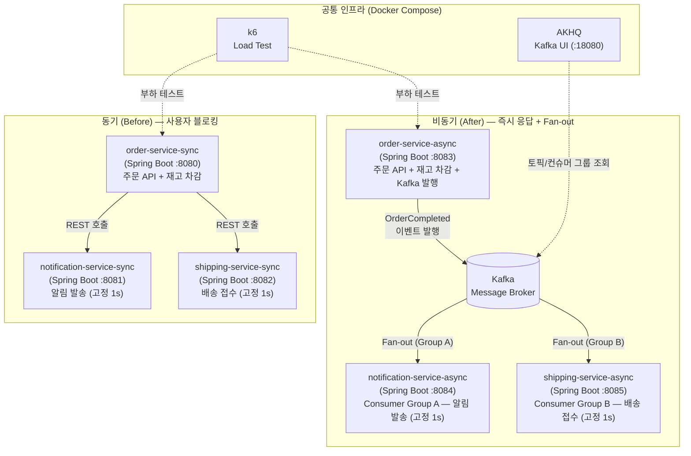
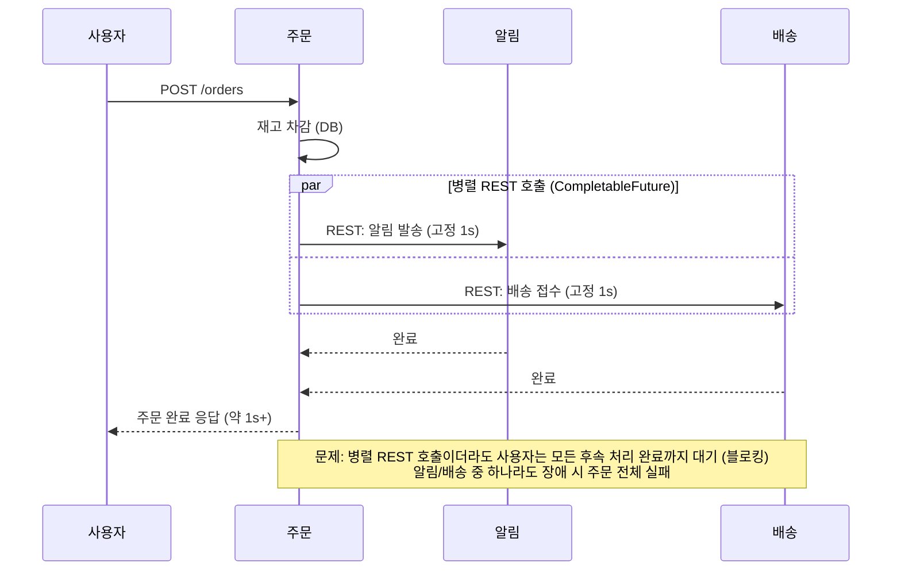
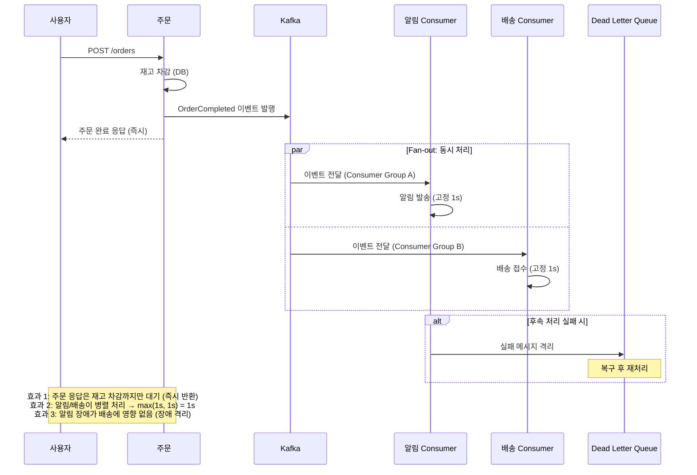
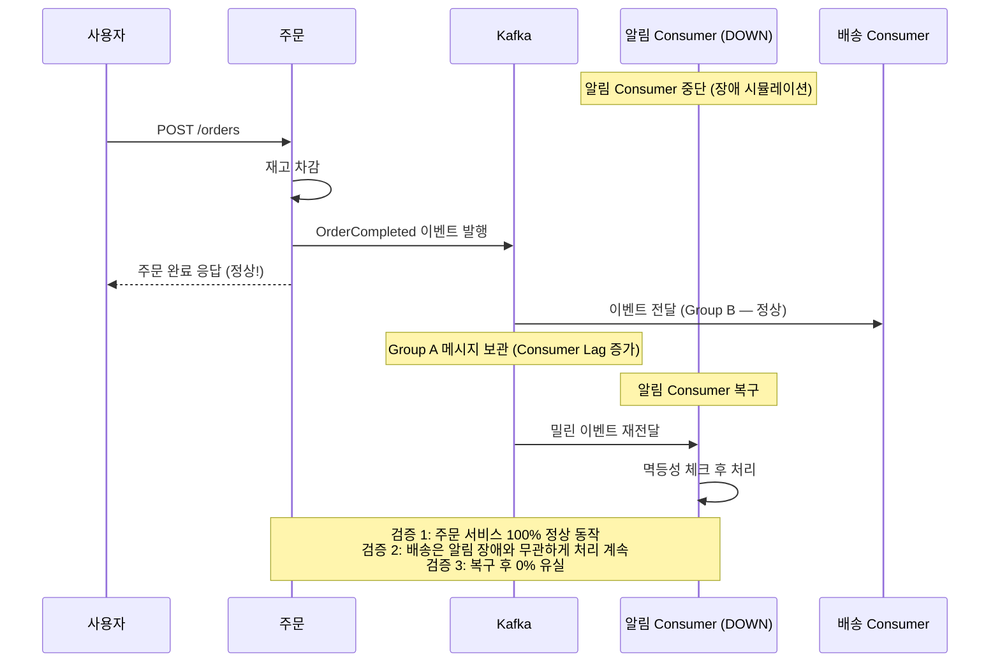
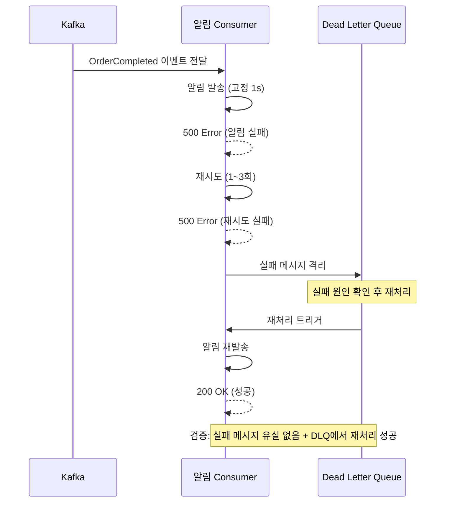

# EDA PoC - How 구조화

## Quick Guide (30초 문서 이해 가이드)
- **핵심 결론:** 이커머스 주문 팬아웃 문제를 동기/비동기 서브 프로젝트로 나란히 구현하고, 정량 비교로 EDA 핵심 가치를 증명한다.
- **확정된 결정:** 5개 Phase (개념학습→기반→핵심검증→심화학습→포트폴리오), Spring Cloud 제외, At Least Once + 멱등성. 비동기는 Fan-out 구조 — 주문 완료 이벤트 1개를 알림/배송 서비스가 독립적으로 동시 소비
- **바로 실행할 내용:** Phase 2에서 Kafka 인프라 + 서브 프로젝트 스캐폴딩 + 기본 이벤트 흐름
- **판단 근거:** 사례 조사 5건(배민/쿠팡/LINE/올리브영/사람인) + 동시성 PoC 부하 테스트 교훈
- **미확정/리스크:** 후속 서비스 지연 시간 구체값(500ms? 1s?), k6 동시 요청 수 최적값

---

## 2W 요약 (from 2w-brainstorm.md)

- **What:** 이커머스 주문 프로세스에서 후속 처리(알림, 배송)가 동기 블로킹으로 묶여 있어 트래픽 증가 시 응답 지연 및 장애 전파 발생 → EDA(Kafka) Fan-out으로 즉시 응답 + 비동기 병렬 분리
- **Why:** 포트폴리오 (채용 시장 능력 검증). JD 키워드 "MSA 경험 우대", "Kafka 사용 경험" 직접 충족
- **제약 조건:** 2주, 혼자, PoC 수준, 별도 프로젝트 (동시성 PoC와 해결하는 문제가 다름)
- **가상 시나리오:** 이커머스 주문 완료 후 알림/배송 팬아웃 문제 (사례 5건 중 4건과 동일 패턴)
- **시나리오 전제:** "주문 완료" = 재고 차감까지 완료된 상태. 이후 알림/배송은 서로 순서 의존성 없는 독립 처리 → Fan-out 적용 가능

---

## 다이어그램

### 유형: C4 Container + Sequence (동기/비동기 비교)

### 1. 전체 시스템 구조 (C4 Container Level)



### 2. 동기 방식 흐름 (Before)



### 3. 비동기 방식 흐름 (After) — Fan-out



### 4-1. 장애 격리 시나리오: Consumer 다운



### 4-2. 장애 격리 시나리오: 후속 처리 실패 → DLQ



### 다이어그램 설명

| 다이어그램 | 보여주는 것 | PoC 검증 포인트 |
|-----------|-----------|----------------|
| **C4 Container** | 전체 서비스 구조 | 동기(블로킹) vs 비동기(Fan-out)를 나란히 비교 |
| **동기 Sequence** | Before: 사용자 블로킹의 문제점 | 병렬 REST 호출이더라도 사용자는 후속 처리 완료까지 대기 |
| **비동기 Sequence** | After: Fan-out 병렬 처리 | 즉시 응답 + 알림/배송 동시 1s + 장애 격리 |
| **장애 격리 4-1** | Consumer 하나 다운 시 나머지 정상 | shipping은 notification 장애와 무관하게 처리 |
| **장애 격리 4-2** | 후속 처리 실패 시 DLQ 격리 | 재시도 → 실패 → DLQ 격리 → 재처리 성공 |

---

## 범위 확정

### ✅ In Scope

| 항목 | 이유 |
|------|------|
| **Producer/Consumer 기본 이벤트 흐름** | EDA의 기본 단위, 모든 사례의 출발점 |
| **동기 vs 비동기 정량 비교** | 포트폴리오 핵심 가치 — "데이터로 증명" |
| **장애 격리 테스트** | 쿠팡/배민의 핵심 도입 동기, EDA의 가장 설득력 있는 가치 |
| **At Least Once + 멱등성** | 배민이 Exactly Once를 제거한 교훈, 현실적 선택 |
| **Dead Letter Queue (DLQ)** | 장애 격리 시연의 핵심, 쿠팡 Vitamin MQ 패턴 |
| **Partition Key 기반 순서 보장** | 배민: 주문별 이벤트 순서 유지 |
| **Consumer Group / Consumer Lag 모니터링** | Kafka 운영 건강도의 핵심 지표 |
| **Docker Compose 원클릭 실행** | 포트폴리오 재현 가능성 |
| **k6 부하 테스트 (자원 제한 적용)** | 동시성 PoC 교훈 — 자원 제한으로 차이 극대화 |

### ❌ Out of Scope

| 항목 | 이유 |
|------|------|
| **Event Sourcing / CQRS / Saga** | PoC 범위 초과, 올리브영도 Streams 조인 간소화 |
| **Exactly Once Semantics** | 배민이 안정성 위해 제거, 복잡도 대비 가치 낮음 |
| **Kafka Connect / Debezium (CDC)** | 학습 비용 높음, 배민도 전담팀 필요 |
| **Schema Registry** | 초기 PoC에서는 JSON 직렬화로 충분 |
| **Kafka Streams** | LINE/올리브영 사례지만 이번 범위 밖 |
| **Spring Cloud (Gateway, Eureka 등)** | Kafka 이벤트 통신이 서비스 간 통신을 대체, 서비스 디스커버리 불필요 |
| **모듈러 모놀리식 전환** | 별도 프로젝트 규모, 로드맵으로만 제시 |
| **Prometheus + Grafana 모니터링 인프라** | 모니터링/로깅 PoC로 분리 |

### ⏸️ Deferred

| 항목 | 조건 |
|------|------|
| **후속 서비스 지연 시간 구체값** | Phase 2 부하 테스트 시 튜닝하며 결정 (500ms~2s 범위) |
| **k6 동시 요청 수 / 자원 제한 최적값** | Phase 2에서 실험적으로 결정 (동시성 PoC 교훈 적용) |
| **Consumer 멀티 인스턴스 스케일링** | Phase 2 시간 여유 시 추가 |

---

## Phase 계획 (Roadmap)

> **⚠️ 아래 날짜는 확정 일정이 아닌 목표 날짜입니다.** `/sprint-start` 시점에 실제 시작일과 비교하여 조정합니다.

### Phase 1: EDA 핵심 개념 학습 (02/28 ~ 03/01, 2일)

**목표:** 구현할 EDA 개념을 먼저 학습하여, 개념을 인지한 상태에서 구현을 시작

| 태스크 | 설명 |
|--------|------|
| Producer/Consumer | 이벤트 발행/구독의 기본 동작 원리 |
| Topic/Partition | 메시지 라우팅, 파티션별 순서 보장 원리 |
| Consumer Group | 다중 Consumer 부하 분산, 리밸런싱 |
| At Least Once + 멱등성 | 전달 보장 수준별 차이, 멱등성 설계 방법 |
| Dead Letter Queue (DLQ) | 실패 메시지 격리/재처리 패턴 |
| Partition Key | 같은 키의 이벤트 순서 보장 원리 |

**Phase 1 완료 기준:** 각 개념을 "왜 필요한지 + 어떻게 동작하는지" 설명 가능, 구현 시작 준비 완료

### Phase 2: 기반 구축 + 기본 이벤트 흐름 (03/02 ~ 03/04, 3일)

**목표:** 6개 서브 프로젝트 스캐폴딩 + Kafka 인프라 + 동기/비동기 기본 동작 확인

| 태스크 | 설명 |
|--------|------|
| **구현 설계** | |
| 프로젝트 구조 설계 | 루트 디렉터리 구조, Gradle 멀티 프로젝트 레이아웃, docs/ 구조 (2W/1H 문서 배치, 테스트 리포트 위치 등) |
| C4 Component 다이어그램 | 각 서브 프로젝트 내부 컴포넌트 구조 설계 (Controller, Service, Producer/Consumer, Repository) |
| Docker Compose 다이어그램 | 컨테이너 간 네트워크/포트/의존관계 시각화 |
| API 설계 | 주문 API 엔드포인트, 요청/응답 스펙, 에러 코드 |
| 이벤트 메시지 설계 | Topic 이름, Partition Key 전략, 메시지 포맷(JSON 스키마) |
| **구현** | |
| 프로젝트 구조 생성 | Gradle 멀티 프로젝트 (6개 서브 모듈) |
| Docker Compose 구성 | Kafka (KRaft 모드, 단일 브로커) + 6개 서비스 |
| 동기 페어링 구현 | order-service-sync → notification-service-sync + shipping-service-sync (재고차감 후 알림/배송 REST 병렬 호출 — 사용자 블로킹) |
| 비동기 Fan-out 구현 | order-service-async → Kafka → notification-service-async (Group A) + shipping-service-async (Group B) |
| 후속 서비스 시뮬레이션 | 알림/배송을 고정 지연(1s) stub으로 구현 |
| 기본 동작 확인 | 동기(병렬 REST, 약 1s+, 사용자 블로킹) / 비동기(즉시 응답 + Fan-out 병렬 1s) 정상 동작 확인 |

**Phase 2 완료 기준:** 구현 설계 문서(C4 Component, Docker Compose, API/이벤트 스펙) 완성 + Docker Compose up으로 6개 서비스 + 인프라가 뜨고, curl로 동기/비동기 주문이 정상 동작

### Phase 3: 핵심 검증 (03/05 ~ 03/08, 4일)

**목표:** EDA의 3대 핵심 가치를 정량/정성 데이터로 증명

| 태스크 | 설명 |
|--------|------|
| **테스트 설계** | |
| 부하 테스트 시나리오 설계 | 동기/비동기 비교 시나리오, 동시 요청 수, 테스트 시간, 자원 제한값 설계 |
| k6 스크립트 설계 | 테스트 단계(ramp-up/steady/ramp-down), 측정 지표, 임계값 정의 |
| 장애 격리 테스트 시나리오 설계 | Consumer 중단/복구 타이밍, DLQ 실패 재현 조건, 검증 포인트 정의 |
| 멱등성 테스트 시나리오 설계 | 중복 메시지 발생 조건, 검증 방법(DB 상태 확인) 설계 |
| **테스트 실행** | |
| k6 부하 테스트 작성 | 동기/비동기 동일 시나리오, 자원 제한 적용 |
| TPS / Latency 측정 | 동기 vs 비동기 p50/p95 비교 |
| 장애 격리 테스트 | Consumer 중단 → Producer 정상 확인 → 복구 후 재처리 |
| 멱등성 구현 + 테스트 | 중복 메시지 수신 시 중복 처리 방지 |
| DLQ 구현 | 실패 메시지 격리 + 재처리 흐름 |
| Consumer Lag 측정 | Kafka 모니터링으로 lag 발생/해소 패턴 확인 |
| 메시지 유실율 측정 | 발행 건수 vs 소비 건수 비교 |

**Phase 3 완료 기준:** 테스트 설계 문서(시나리오, k6 스크립트, 장애/멱등성 검증 조건) 완성 + 동기 vs 비동기 성능 비교 데이터 확보 + 장애 격리 시연 가능 + 메시지 0% 유실

### Phase 4: EDA 심화 개념 학습 (03/09 ~ 03/11, 3일)

**목표:** 구현하지 않았지만 알아야 할 개념을 학습하여, 포트폴리오에 "왜 안 썼는가" + "다음 Step" 인사이트를 반영

| 태스크 | 설명 |
|--------|------|
| Exactly Once Semantics | 왜 배민이 제거했는가, At Least Once와의 트레이드오프 |
| Transactional Outbox | DB 트랜잭션 + 이벤트 발행 원자성, Debezium 동작 원리 |
| Event Sourcing / CQRS | 상태 vs 이벤트 이력, 명령/조회 분리의 적용 시나리오 |
| Saga Pattern | Choreography vs Orchestration, 분산 트랜잭션 보상 처리 |
| Schema Registry | 스키마 진화 문제, 버전 관리 필요성 |
| Kafka Streams / Connect | 라이브러리 vs 프레임워크, CDC 패턴의 장점 |

**Phase 4 완료 기준:** 각 개념을 "무엇이고, 왜 이번에 안 썼고, 언제 필요한지" 설명 가능

**Phase 4가 포트폴리오 직전에 오는 이유:**
- 구현 경험 후에 공부하면 "왜 안 썼는가"를 **경험 기반으로** 설명 가능
- 포트폴리오에 트레이드오프 문서 + 다음 Step 로드맵 반영 가능
- 면접 대비: "Exactly Once를 왜 안 썼나요?" → 구현 경험 + 개념 이해 둘 다로 답변

### Phase 5: 포트폴리오 완성 (03/12 ~ 03/13, 2일)

**목표:** 채용 시장에서 "이 사람에게 맡길 수 있다"를 증명하는 포트폴리오 산출물 완성

| 태스크 | 설명 |
|--------|------|
| **문서 설계** | |
| README 구조 설계 | 섹션 구성(시나리오/아키텍처/실행방법/결과), 독자 흐름, 핵심 전달 메시지 정의 |
| 성능 비교 리포트 구조 설계 | 비교 항목, 그래프 유형, Before/After 표현 방식 설계 |
| 포트폴리오 스토리라인 설계 | 동시성 제어 PoC → EDA PoC 연결 서사, 면접 예상 질문별 답변 포인트 정리 |
| **문서 작성** | |
| README 작성 | 가상 시나리오 + 아키텍처 + 실행 방법 + 성능 비교 결과 |
| 성능 비교 리포트 | TPS/Latency 그래프, Before/After 수치 비교 |
| 트레이드오프 문서 | "왜 Exactly Once를 안 썼는가", "왜 Spring Cloud가 필요 없는가" 등 (Phase 4 학습 반영) |
| 다음 Step 로드맵 | 이번에 안 한 것들의 도입 시나리오 정리 (Phase 4 인사이트 반영) |

**Phase 5 완료 기준:** 문서 설계(구조/스토리라인) 완성 + README만 보고 프로젝트 실행 + 성능 비교 가능, 면접에서 "왜 이렇게 했는가" + "왜 이건 안 했는가" 모두 설명 가능

> 각 Phase는 `/sprint-start`를 통해 구체적인 Sprint로 실행됩니다.

---

## 평가 지표

### 정량 지표

| 지표 | 측정 방법 | 목표 |
|------|----------|------|
| **TPS (처리량)** | k6 부하 테스트, 동기 vs 비동기 | 비동기 TPS > 동기 TPS (측정 가능한 차이) |
| **Latency p50/p95** | k6 End-to-end 응답 시간 | 비동기가 측정 가능하게 낮음 (후속 처리 대기 제거) |
| **Consumer Lag** | Kafka 모니터링 | 부하 시 lag 증가 → 정상 시 감소 패턴 확인 |
| **메시지 유실율** | 발행 건수 vs 소비 건수 | 0% 유실 |
| **장애 격리** | Consumer 중단 → Producer 응답 | Producer 100% 정상 동작 |

> **자원 제한 원칙 (동시성 PoC 교훈):** 자원이 널널하면 차이가 안 보임.
> 후속 서비스에 고정 지연(1s)을 적용하고, 동시 요청 > 처리 용량이 되도록 설정.
> 변인 통제를 위해 메인 비교는 고정값, 가변 지연은 보조 테스트로 분리 (ADR-006 참고).

### 정성 지표

| 지표 | 기준 |
|------|------|
| **재현 가능성** | Docker Compose up + README만으로 실행 가능 |
| **명확한 결론** | "동기 vs 비동기, 어떤 상황에 어떤 방법"이 데이터로 증명됨 |
| **문제 기반 판단** | "왜 EDA를 도입했는가"에 가상 시나리오 + 사례 근거로 답할 수 있음 |
| **트레이드오프 인지** | "왜 Exactly Once를 안 썼는가" 등 의도적 제외 항목 설명 가능 |
| **면접 대비** | 구현하지 않은 개념(Saga, CQRS 등)도 설명 가능 |

---

## ADR (Architecture Decision Records)

### ADR-001: 6개 서브 프로젝트로 동기/비동기 분리
- **Decision:** 브랜치 분기 대신 6개 서브 프로젝트(동기 3 + 비동기 3)로 구성. 동기: order/notification/shipping-sync, 비동기: order-async + Fan-out Consumer(notification/shipping-async)
- **Why:** 나란히 놓고 즉시 비교 가능, 포트폴리오에서 "같은 문제를 두 가지 방식으로 풀었다"가 시각적으로 명확

### ADR-002: Spring Cloud 제외
- **Decision:** Spring Boot + Docker Compose만 사용, Spring Cloud(Gateway, Eureka 등) 미사용
- **Why:** 비동기 측 서비스 간 통신은 Kafka 이벤트로 대체되므로 서비스 디스커버리 불필요. 동기 측은 직접 REST 호출로 충분

### ADR-003: At Least Once + 멱등성 (Exactly Once 제외)
- **Decision:** Exactly Once Semantics를 사용하지 않고, At Least Once + 멱등성으로 구현
- **Why:** 배민이 안정성 위해 Exactly Once를 오히려 제거한 사례. 복잡도 대비 가치 낮음. 면접에서 "왜 안 썼는가" 설명이 더 가치 있음

### ADR-004: 별도 프로젝트 (동시성 PoC와 분리)
- **Decision:** 기존 동시성 제어 PoC에 추가하지 않고 별도 프로젝트로 진행
- **Why:** 재고 차감은 동기든 비동기든 빠르다. EDA가 해결하는 문제(팬아웃/장애 격리)는 동시성 제어와 별개. 무리한 연결보다 별도 프로젝트가 자연스러움

### ADR-005: 후속 서비스 지연은 현실적 시뮬레이션
- **Decision:** 알림/배송 서비스에 지연을 적용
- **Why:** 동시성 PoC에서는 100ms sleep이 인위적이었으나, 이번에는 외부 API 호출(SMTP, 물류/배송 시스템 연동)이 현실적으로 느림. 테스트 시나리오 신뢰도 높음

### ADR-006: 부하 테스트 시 고정 지연으로 변인 통제
- **Decision:** 메인 성능 비교 테스트에서 후속 서비스 지연을 고정값(1s)으로 설정. 가변 지연(500ms~2s)은 보조 테스트로만 사용
- **Why:** 가변(랜덤) 지연을 쓰면 테스트 결과의 차이가 아키텍처(동기 vs 비동기) 때문인지 랜덤 지연 때문인지 구분 불가. 고정값으로 변인을 통제해야 순수한 아키텍처 차이를 측정할 수 있음
- **Trade-off:** 현실에서는 지연이 가변적이므로, 고정값만으로는 현실성이 부족할 수 있음. 이를 보완하기 위해 가변 지연 보조 테스트를 선택적으로 수행

### ADR-007: Kafka 네이밍 컨벤션

**상태:** Accepted (2026-02-28)

**Context:**
- Phase 2에서 Topic/Consumer Group 이름이 코드, 설정, 다이어그램에 반복 등장한다.
- 이름 규칙이 없으면 운영 중 역할 식별, 장애 분석, 버전 마이그레이션이 어려워진다.
- PoC라도 이후 확장(새 Consumer 추가, 버전 분리)을 고려한 최소 규칙이 필요하다.

**Decision:**
1. Topic: `{domain}.{event}.v{n}` — 예: `order.order-completed.v1`
2. Consumer Group ID: `{env}.{domain}.{service}.{purpose}.v{n}` — 예: `dev.order.notification.event-consumer.v1`
3. 동적 값(타임스탬프, 인스턴스 ID)은 Topic/Group ID에 포함하지 않는다.

**Consequences:**
- 장점: 이름만으로 역할 식별 가능, 로그/모니터링 필터링이 쉬움, 버전 병행 운영이 가능
- 비용: 네이밍 길이가 다소 길어짐

---

### ADR-008: WebFlux(Reactive) 대신 EDA(Kafka)를 선택한 이유

**상태:** Accepted (2026-02-28)

**Context:**

주문 API에서 후속 처리(알림, 배송)가 사용자 응답을 블로킹하는 문제를 해결하려 할 때, Spring WebFlux 기반의 리액티브 프로그래밍이 대안으로 고려될 수 있다. WebFlux는 서버 스레드를 블로킹하지 않으면서 비동기 처리를 가능하게 하므로, 얼핏 EDA 없이도 문제를 해결할 수 있어 보인다.

**WebFlux가 실제로 해결하는 것**

WebFlux는 **서버 스레드 효율**을 높인다. 기존 Spring MVC에서는 요청 1개당 스레드 1개가 필요해 동시 요청이 많아질수록 스레드 풀이 소진된다. WebFlux는 이벤트 루프 기반으로 소수의 스레드가 다수의 요청을 처리한다.

하지만 `Mono.zip(알림호출, 배송호출).subscribe()`로 병렬 호출을 하더라도, **HTTP 커넥션은 여전히 열려 있고 사용자는 모든 호출이 완료될 때까지 대기한다.** 서버 스레드가 블로킹되지 않을 뿐, 사용자 입장에서의 응답 시간은 `max(알림 지연, 배송 지연)`이 된다.

```
WebFlux + 병렬 reactive 호출:
  사용자 → POST /orders
         → Mono.zip(알림 API 호출(1s), 배송 API 호출(1s))
         → 서버 스레드는 놀고 있음 (non-blocking)
         → 그러나 HTTP 응답은 1s 후 반환
         → 사용자는 여전히 1s 대기

EDA:
  사용자 → POST /orders
         → 재고 차감 (수십 ms)
         → Kafka 이벤트 발행 (수 ms)
         → 즉시 HTTP 응답 반환
         → 알림/배송은 사용자와 무관하게 백그라운드 처리
```

**"fire-and-forget"을 WebFlux로 구현할 수 있지 않는가**

`Mono.subscribe()`를 await 없이 호출해 즉시 응답을 반환하는 방식으로 구현할 수 있다. 그러나 이 경우 다음 문제가 발생한다:

1. **내구성 부재:** 알림/배송 호출이 실패해도 아무도 알 수 없다. 재시도 로직을 직접 구현해야 한다.
2. **메시지 유실:** 서버 재시작, OOM, 배포 등으로 처리 중이던 비동기 작업이 소멸한다. Kafka는 이벤트를 디스크에 보관하므로 Consumer가 재시작되어도 이어서 처리한다.
3. **장애 격리 미지원:** 알림 서비스가 다운되면 WebFlux의 비동기 호출도 실패한다. 이를 처리하려면 Circuit Breaker, Fallback, 재시도 정책을 모두 직접 구현해야 하며, 복잡도가 Kafka + DLQ보다 높아진다.
4. **관측성 부재:** 몇 건이 처리됐는지, 몇 건이 실패했는지, Consumer Lag는 얼마인지 추적할 수단이 없다. Kafka는 Consumer Group Lag, 메시지 수를 기본으로 제공한다.

**EDA가 추가로 해결하는 것**

| 문제 | WebFlux | EDA (Kafka) |
|------|---------|-------------|
| 서버 스레드 효율 | ✅ 해결 | 상관없음 |
| 사용자 응답 블로킹 | ❌ 여전히 대기 | ✅ 즉시 응답 |
| 후속 처리 실패 시 유실 | ❌ 유실 가능 | ✅ Kafka 보관 → 재처리 |
| 장애 격리 | ❌ 직접 구현 필요 | ✅ Consumer Group 독립 |
| 알림 장애가 배송에 영향 | ❌ 영향 있음 | ✅ 영향 없음 (별도 Group) |
| 재시도 / DLQ | ❌ 직접 구현 | ✅ 기본 제공 |
| 처리 현황 관측 | ❌ 별도 구현 필요 | ✅ Consumer Lag 기본 제공 |

**Decision:**

주문 API의 후속 처리 분리에 WebFlux가 아닌 EDA(Kafka)를 선택한다.

WebFlux는 서버 자원 효율 문제를 해결하지만, 이 PoC가 검증하려는 핵심 가치인 **즉시 응답**, **장애 격리**, **메시지 내구성**은 해결하지 못한다. EDA는 이 세 가지를 아키텍처 수준에서 보장하며, 복잡한 재시도/장애 처리 로직을 애플리케이션 코드 대신 인프라 수준에서 처리한다.

두 기술은 대체재가 아니라 보완재다. 고트래픽 시스템에서는 WebFlux로 API 서버의 스레드 효율을 높이고, EDA로 후속 처리를 분리하는 패턴을 함께 사용한다.

**Consequences:**
- 장점: 즉시 응답 + 장애 격리 + 메시지 내구성을 별도 인프라 코드 없이 확보
- 비용: Kafka 인프라 운영 비용, Consumer 서비스 추가 구성 필요
- 면접 활용: "WebFlux로 해결하면 되지 않나요?" 질문에 이 ADR을 근거로 명확히 답변 가능
